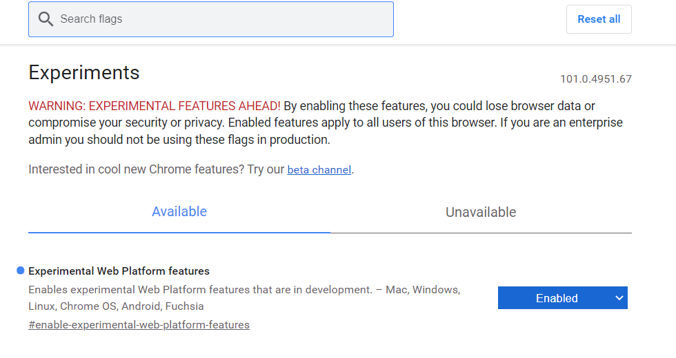

## 개요

예전에 동아리에서 CSS 애니메이션이 가득한 사이트를 클론 코딩하는 과제를 받았던 적이 있다.

당시에 스크롤을 내리면서 나타나는 애니메이션을 보며 이것도 JS 없이 CSS로 할 수 있는 건가?(아무래도... js없이 css로 애니메이션을 만드는게 성능에 더 좋으니깐.) 궁금했었는데, 스택오버플로우에서 찾아보니 단호하게 방법이 없다는 글만 나왔던 기억이 있다.

그러다 [**`animation-timeline`**](https://developer.mozilla.org/en-US/docs/Web/API/AnimationTimeline)이라는 Web Animations API를 알게 됐다.
어쩐지 한글 문서는 잘 안 나오더라니 크롬 experimental 기술이었다.
chrome experiments는 크롬에서 최신 웹 기술을 선보이는 것이라고 한다.

사용하려면 `chrome://flags에 접속해서 experimental web platform features`를 enabled로 바꿔줘야 한다.



여기서 하나 알고 가야할 [**`@supports`**](https://developer.mozilla.org/ko/docs/Web/CSS/@supports) 라는 at-rule이 있는데, 사용 시 브라우저가 지원이 될 때 스타일을 적용시킨다.

scroll-timeline에 대한 자세한 설명은 [**여기서**](https://www.bram.us/2021/02/23/the-future-of-css-scroll-linked-animations-part-1/) 볼 수 있다.

먼저 `time-range`를 알아보면, time range는 *시간을 의미하는 게 아니라, 스크롤 바 진행정도와 애니메이션 진행정도에 맵핑되는 숫자*라고 한다.

> TIP: Always set time-range to the exact same time as the animation-duration, unless you have a very good reason not to.

팁에 따라 애니메이션 duration time과 time-range를 일치시키도록 하자.

`linear vs ease-in`에 대한 설명도 나와 있다.

> TIP: Always set animation-timing-function to linear when working with @scroll-timeline.

문서에서는 linear을 쓰는 걸 권장하는데, 이유는 애니메이션 진행정도와 스크롤 진행정도는 맵핑되는데 스크롤에 따라 갑자기 빨라지는 애니메이션은 이상하게 느껴지기 때문이다.

## 실습

그럼 스크롤에 따라 다른 속도 애니메이션을 만들어보자.

```html
<section id="first">
  <div><h1 class="first-header">This is Header</h1></div>
  <div><h1 class="second-header">This is Header</h1></div>
</section>
```

```css
@supports (animation-timeline: works) {
  .first-header {
    animation: 3s linear forwards move-text-down;
    animation-timeline: move-timeline-first;
  }

  @scroll-timeline move-timeline-first {
    time-range: 1s;
  }

  @keyframes move-text-down {
    from {
      transform: translateY(0);
    }
    to {
      transform: translateY(200%);
    }
  }

  .second-header {
    animation: 1s linear forwards move-text-up;
    animation-timeline: move-timeline-second;
  }
  @scroll-timeline move-timeline-second {
    time-range: 1s;
  }
  @keyframes move-text-up {
    from {
      transform: translateY(0);
    }
    to {
      transform: translateY(-100%);
    }
  }
}
```

https://codepen.io/suu3/pen/azoZLEe

지원되는 브라우저에서만 확인해 볼 수 있다.

translateY 값을 다르게 줘서 속도에 차이를 줬다. 두 h1이 같은 크기지만 first-header가 먼저 border를 침범하게 된다.

## Reference

1. [https://www.youtube.com/watch?v=EkEyA4RtfNE](https://www.youtube.com/watch?v=EkEyA4RtfNE)
2. [https://css-tricks.com/practical-use-cases-for-scroll-linked-animations-in-css-with-scroll-timelines/](https://css-tricks.com/practical-use-cases-for-scroll-linked-animations-in-css-with-scroll-timelines/)
3. [https://www.bram.us/2021/02/23/the-future-of-css-scroll-linked-animations-part-1/](https://www.bram.us/2021/02/23/the-future-of-css-scroll-linked-animations-part-1/)
