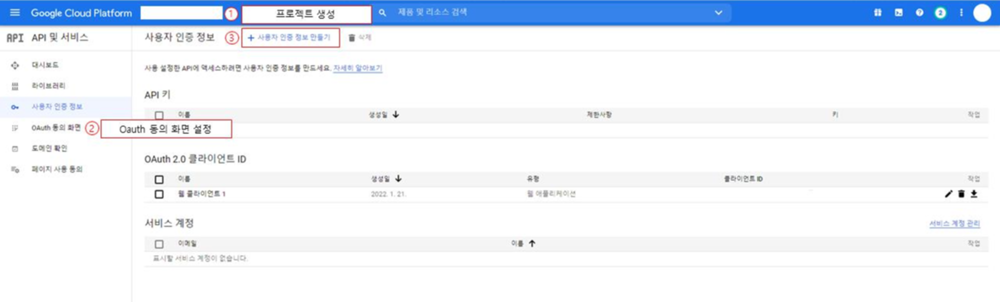
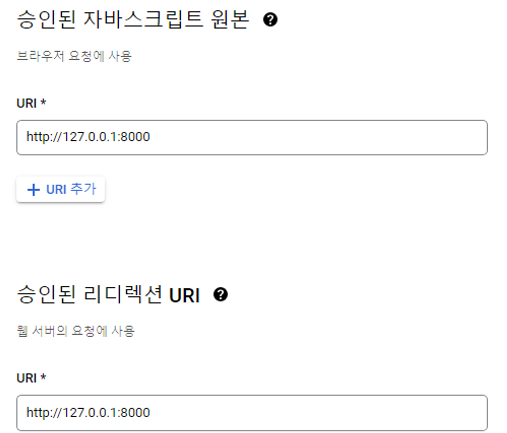
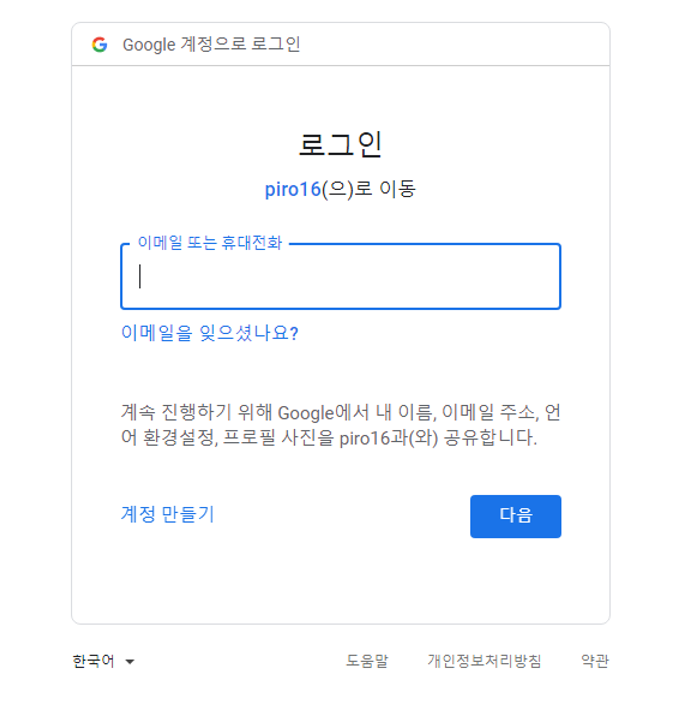
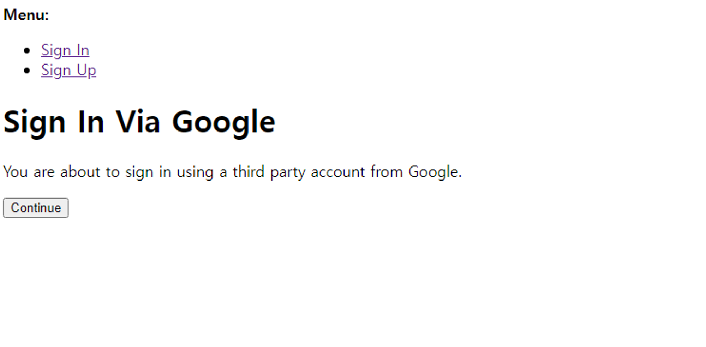

## 개요

장고 프로젝트를 진행하면서 구글 소셜 로그인을 맡게 되었다.

구글 로그인에는

1. **allauth를 사용하는 방법**
2. **social-auth-app-django를 이용하는 방법**

두 가지가 있다.

결론부터 말하면 1번대로 했다가 생각대로 안 되는 부분이 있어서 나는 **2번 방법**을 사용했다.

## **0. 공통: google API 발급받기**

[**구글 클라우드**](https://console.cloud.google.com/)에서 API 키를 발급 받을 수 있다.

사진에서 3번까지 수행하면 client id와 key를 발급받을 수 있다.



일단 사진과 같이 넣고, 후에 오류가 뜬다면 리디렉션 URI를 수정해야 한다. 관련 부분은 뒤에서 서술하도록 하겠다.

## **1. allauth**

먼저 패키지를 설치한다.

```python
pip install django-allauth
```

**1. settings.py**

```python
INSTALLED_APPS = [
    ...
    'django.contrib.sites',

#allauth'allauth',
    'allauth.account',
    'allauth.socialaccount',

#provider'allauth.socialaccount.providers.google',
]

...
AUTHENTICATION_BACKENDS = (
    'django.contrib.auth.backends.ModelBackend',
    'allauth.account.auth_backends.AuthenticationBackend',
)

SITE_ID = 1
LOGIN_REDIRECT_URL = '/'
```

migrate를 해줘야한다.

**2. urls.py**

```python
...
urlpatterns = [
    ...
    path('accounts/', include('allauth.urls')),
]
```

여기서 accounts/는 원하는 url대로 설정해줘도 된다. (구글 웹 애플리케이션 키 발급받을 때 redirect url에만 맞게 넣어주면 된다.)

**3. db**

admin 계정으로 db에 들어가면 **sites와 social accounts가** 새로 생겼을 것이다.

**sites**에 들어가 보면 기본적으로 example이 생성되어 있는데, example을 127.0.0.1:8000로 수정하거나 새로 127.0.0.1:8000를 추가한다.

display와 도메인 이름에 127.0.0.1:8000을 적어준다.
localhost 주소를 추가했을 때 example을 수정했다면 위의 settings.py에서 SITE_ID를 1로,

그다음 **Social applications-Add social application**으로 들어가 새로 앱을 추가해준다.

provider를 google로 설정하고, id와 secret key를 0번에서 발급받은 키로 넣는다.
sites에는 127.0.0.1:8000를 추가한다.

**4. html**

```python


...
<a href=" ">구글 로그인</a>
```

여기까지 끝. 만약 **Error: redirect_uri_mismatch** 가 뜬다면 설정해야 할 redirect URI 주소까지 알려준다.

**redirect URI in request**~ 에 나온 주소를 0번의 **승인된 리다이렉션 URI**에 추가한다.

### **1-1. 여기까지 왔을 때 내 문제 🤔**

나는 구글 로그인 버튼을 누르면 바로 이 화면이 나오길 원했는데 🔽



버튼을 눌렀을 때 이 화면이 먼저 나왔고 Continue를 눌러야 인증으로 넘어갔다. 🔽



찾아봤을 때 다음 글을 참고할 수 있었다.

- [**template 커스텀 방법까지 나와있는 참고 사이트**](https://learndjango.com/tutorials/django-log-in-email-not-username)
- [관련 Issue](https://github.com/pennersr/django-allauth/issues/345)

위 글들을 참고했을 때, 나는 바로 소셜로그인 화면으로 바뀌는걸 원했어서 1번은 포기하고 2번 방법으로 넘어갔다. (\*2번은 db설정을 해줄 필요가 없어서 좀 더 간편하다.)

## **2. social-auth-app-django**

```python
pip install social-auth-app-django
```

먼저 패키지를 설치해줘야 한다.

**1. settings.py**

```python
...

INSTALLED_APPS = [
    ...,
    'social_django',
    ...
]

....

AUTHENTICATION_BACKENDS = (
#Needed to login by username in Django admin, regardless of 'allauth''social_core.backends.google.GoogleOAuth2',

# 'allauth' specific authentication methods, such as login by e-mail'django.contrib.auth.backends.ModelBackend',
)

SOCIAL_AUTH_URL_NAMESPACE = 'login:social'

LOGIN_REDIRECT_URL='/'#소셜 로그인 후 돌아갈 화면

SOCIAL_AUTH_GOOGLE_OAUTH2_KEY = '발급받은 id'
SOCIAL_AUTH_GOOGLE_OAUTH2_SECRET = '발급받은 비밀키'
SOCIAL_AUTH_GOOGLE_OAUTH2_SCOPE = ['email'] # 이메일로 식별하겠다.
```

작성 후 migrate를 해줘야 한다.

나는 login이라는 app 안 urls.py에 social url을 추가했기 때문에 **SOCIAL_AUTH_URL_NAMESPACE = 'login:social'라고** 써주었지만, 기본 프로젝트 urls.py에 social url을 추가해줬다면 'social'이라고 적어줘야 한다.

KEY의 경우 깃헙에 올라가지 않게 안전하게 보관해야 한다는 것을 유의하자. env 설정 방법이 있는데 여기선 생략한다.

**login/urls.py**

```python
from django.urls import path, include

...

urlpatterns = [
    ...
    path('', include('social_django.urls', namespace='social')),
]
```

위 path를 어디에 있는 urls.py에 넣냐에 따라 settings.py의 SOCIAL_AUTH_URL_NAMESPACE를 다르게 써줘야 한다는 것을 주의하자.

구글링 해보면 path대신 url을 쓰는 코드들이 많이 나오는데, url은 장고 최신 버전에서 deprecated 되었기 때문에 path로 작성해줘야 한다.

**html**

```
<a href="">구글 로그인</a>
```

login app -> social namespace -> begin

begin은 신경 쓸 필요 없으나 위에서 app 이름과 nampspace를 어떻게 적어줬는지 주의해서 작성하자.
여기서도 마찬가지로 리다이렉션 시 **Error: redirect_uri_mismatch** 가 뜬다면 **redirect URI in request**~ 에 나온 주소를 0번의 **승인된 리다이렉션 URI**에 추가한다.
