## 01 프로젝트 설명

학교에서 **딥러닝을 사용한 감정인식 챗봇 스피커 제작** 을 주제로 프로젝트를 진행하고 있다. 스피커의 이름은 사용자에게 친숙하게 다가올 수 있게, 친구라는 뜻을 가진 '버디'라고 지었다.  
버디의 주 기능은 **사용자와 대화를 통해 우울감을 해소시켜주는 것**이다.

우울증은 무기력증을 동반하기때문에 환자가 직접 치료에 나서는 게 어렵고 환자가 주변 사람들에게 고민을 털어놓는 것 또한 어렵다.  
사용자 가까이에 존재하면서 먼저 말을 걸어주는 기능을 탑재한, 위로나 의학적 안내를 건네는 인공지능 챗봇을 만들면 우울한 사람들에게 도움이 되지 않을까 하는 생각에서 프로젝트를 시작하게 되었다.

우리 팀에서 내세우고 있는 프로젝트 특징은 크게 세가지이다.

1. 사용자의 표정을 관찰하여 우울하다고 판단되면 스피커가 먼저 말을 건다.

2. 대화를 진행하면서 계속 사용자의 감정을 분석해 적절한 치료를 받을 수 있도록 안내한다.

3. TTS 모델 타코트론을 사용하여 사용자에게 더욱 친숙하게 다가간다.

나는 이 세 가지 중 **1번 - 얼굴 표정 감정 분석 파트**를 맡았으며 해당 주제로 글을 쓰려고 한다.

1번의 구체적인 플로우는 사용자와 가까운 곳에 배치된 스피커가 카메라를 사용해 사용자의 얼굴을 주기적으로 찍어서 표정의 감정을 분석하는 것이다. 메인보드로 라즈베리파이3 B+를 쓸 것이기 때문에, 카메라는 라즈베리파이 카메라 5MP를 사용했다.

## 02. 얼굴 표정 분석 - 외부 서비스에서 제공해주는 Face API 사용하기

얼굴 표정 분석을 위해 쓸 수 있는 방법으로는 Face API가 있다.  
사용할 API는 **Microsoft azure의 Cognitive Service - Face API**이다.

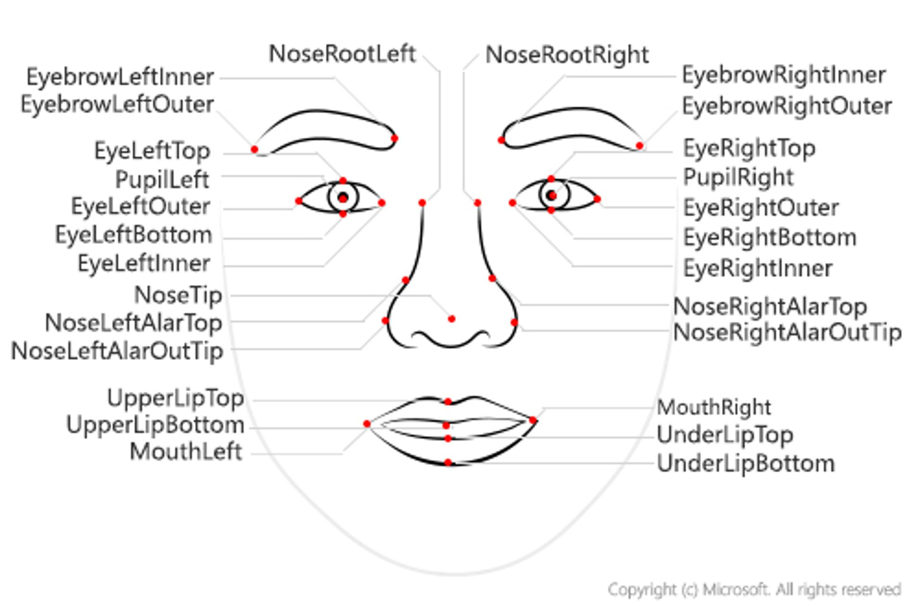
▲ Face API의 landmark

Microsoft Azure의 Face API는 landmark로 27개를 사용한다고 한다. 감정분류는 anger, contempt, distgust, fear, happiness, neutral, sadness, surprise 8가지로 되어있다.  
그 외 API가 어떤 구조로 되어있는지는 정보 공개가 되어있지 않은 것 같다.

[**해당 사이트**](https://azure.microsoft.com/ko-kr/services/cognitive-services/face/)에서 Face API의 기능을 간단히 테스트 해볼 수 있다.

이 프로젝트에서 사용한 건 표정분석만이지만, **나이, 성별, 얼굴 식별 등의 기능** 또한 제공한다고 한다.

### API 사용을 위한 간단한 사전 절차

1. API를 사용하기 위해 먼저 Microsoft azure 가입을 해야한다. 참고로 azure에서는 student계정에 대해 12개월 간 무료로 100달러의 크레딧을 제공하고 있다. (나 또한 학생용 Azure을 사용 중이다.)

2. Subscribe Key를 얻기 위해선 리소스를 만들어야 한다.

   - [**azure potal**](https://portal.azure.com/#home)의 Cognitive Services에 들어간다.
   -  face를 선택하면 된다.

3. 사진에서 구독 키와 엔드포인트를 확인할 수 있다.
   - 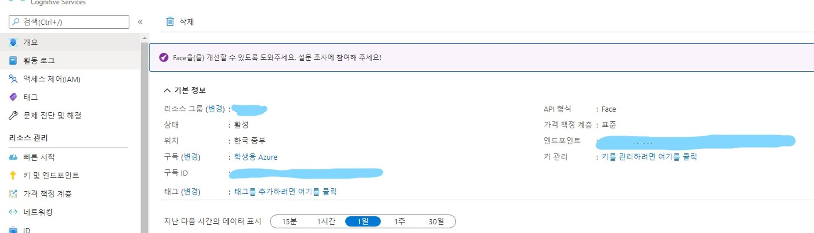

### 코드

설치해야할 패키지는 두가지이고, 코드는 다음과 같다.

코드를 실행시키면 웹캠으로 사진을 일정시간 간격(일단은 약 2초 정도로 설정했다)으로 캡쳐해서 **사진 저장-> 감정 출력-> 사진 삭제**를 반복한다.

```python
!pip install cognitive_face
```

```python
!pip install opencv-python
```

```python
import cognitive_face as CF
import cv2
KEY = "PASTE YOUR KEY"
CF.Key.set(KEY)

BASE_URL = 'https://koreacentral.api.cognitive.microsoft.com/face/v1.0/'
CF.BaseUrl.set(BASE_URL)

#웹캠으로부터 사진을 캡쳐해서 분석하는 코드
camera = cv2.VideoCapture(0)
while True:
    ret, image = camera.read()
    if(int(camera.get(1)) % 60 == 0):
        print('Saved image ' + str(int(camera.get(1))))
        cv2.imwrite("emotions/frame.png", image)
        img_url = './emotions/frame.png'
        faces = CF.face.detect(img_url, True, False, "age, gender, emotion")

        for i in faces:
            sadness = i['faceAttributes']['emotion']['sadness']
            print('sadness', sadness)
            print(i)
            print()

#사진 삭제if os.path.isfile(img_url):
        	os.remove(img_url)

# q를 누르면 종료된다if cv2.waitKey(1) & 0xFF == ord('q'):
        break

camera.release()
cv2.destroyAllWindows()

'''
#사진 분석을 위해 사용하는 코드
img_url = 'PASTE URL'
faces = CF.face.detect(img_url, True, False, "age, gender, emotion")

for i in faces:
    sadness = i['faceAttributes']['emotion']['sadness']
    print('sadness:', sadness)
    print(i)
    print()

#얼굴 주변 사각형 그리기
import requests
from io import BytesIO
from PIL import Image, ImageDraw

def getRectangle(faceDictionary):
    rect = faceDictionary['faceRectangle']
    left = rect['left']
    top = rect['top']
    right = left + rect['width']
    bottom = top + rect['height']
    return ((left, top), (right, bottom))

#http~ url일 때
#response = requests.get(img_url)
#img = Image.open(BytesIO(response.content))

#로컬 이미지일 때
img = Image.open(img_url)
draw = ImageDraw.Draw(img)
for face in faces:
    draw.rectangle(getRectangle(face), outline='red')

img.show()
'''

```

KEY에는 위의 구독키를 넣고, BASE_URL에는 위치에 맞는 URL을 넣으면 된다.([**여기**](https://westus.dev.cognitive.microsoft.com/docs/services)에서 URL을 찾을 수 있다.)  
나는 한국 중부 URL을 넣었다.

### 테스트

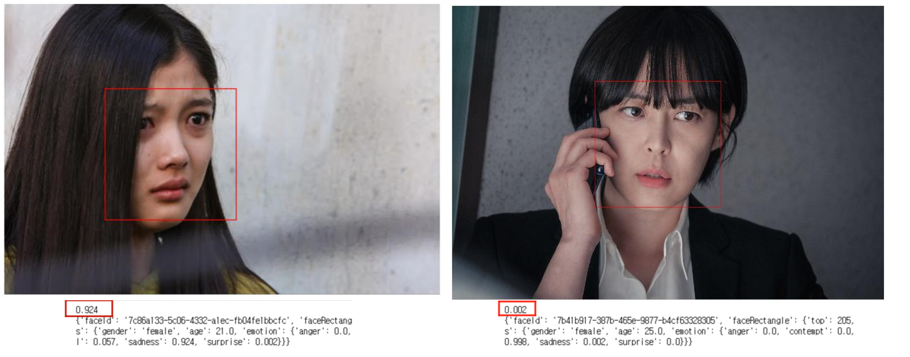

드라마 사진으로 테스트 했을 때, 위와 같은 결과가 나왔다.
(슬픈 표정ㅡ sadness: 0.924 / 무표정ㅡ sadness: 0.002, neutral: 0.998)

'울 것 같은 얼굴'도 잘 인식하는 모습이다.

실제론 사진이 아니라 카메라 캡쳐방식으로 동작할 것이므로, 얼굴을 주기적으로 찍는 코드도 한번 실행 시켜보았다.  
(테스트 할만한 적절한 영상을 찾기가 어려워서... 그냥 직접 웹캠을 키고 슬픈 영상 찾아 보면서 테스트를 해봤다 ㅎ)

총 71프레임이었고, matplotlib으로 나타냈을 때 다음과 같았다.

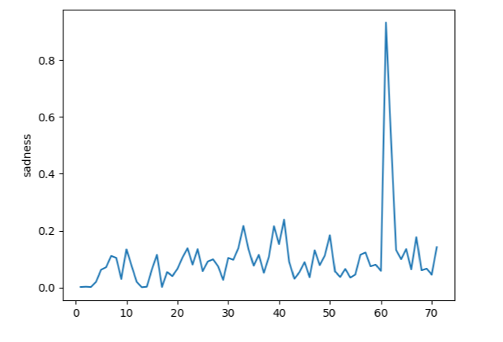

▲ x축 = 프레임 번호(시간순으로 봐도 무방), y축 = sadness

무표정->눈물까지 가는 데 얼마 걸리지 않은 모습이다.
사람이 봤을 때 '슬퍼 보이는' 사진은 40부터였는데, 그래프 상에서는 차이를 확인할 수 없었다. 대신 60(=얼굴이 일그러지면서 울음이 터지는 사진)에서 반짝 하고 최고치 (0.932)를 찍었다.

웹캠으로 테스트 해본 결과, 사진으로 테스트 해봤을 때 생각하지 못했던 변수가 몇가지 있었다.  
**순간 캡쳐라 흔들린 사진이 찍힌다는 점, 카메라 화질에 영향을 받는 점** 등의 이유로 **빨개진 눈 같은 특징을 가진 '울 것 같은' 얼굴이나 눈물은 인식할 수 없었고**, 대신 확실하게 **입꼬리가 내려가거나 얼굴이 찡그려진 순간은 포착**한다는 걸 확인해 볼 수 있었다.

## 02. 얼굴 표정 분석 - 캐글 데이터로 표정분석하기

표정 분석방법으로는**캐글 데이터를 활용해서 직접 학습시키는 방법**도 있다.  
1번의 Face API는 (무료 크레딧으로 해결할 수 있지만) 아무래도 비용이 나갈 수 있기 때문에 직접 학습시키는 방법도 생각해볼 수 있다.

표정 분석은 얼굴 인식 - 표정 분류 두 단계로 이루어진다. 
위의 Face API가 기본적으로 얼굴인식부터 표정분류까지 학습된 모델을 다 제공한다면, 여기서는 하나하나 구성해야 한다.

### 얼굴 인식

먼저, 얼굴 인식을 위해서 opencv에서 제공하고 있는 cascade 기반으로 미리 학습된 정면 얼굴 데이터(haarcascade_frontalface_default.xml)를 사용할 수 있다.

```python
pip install opencv-python
```

```python
import cv2
face_detection = cv2.CascadeClassifier('haarcascade_frontalface_default.xml')
```

혹은 dlib 라이브러리를 이용할 수도 있다.

```python
pip install dlib
```

```python
import dlib
face_detector = dlib.get_frontal_face_detector()
```

이런식으로 사용할 수 있다.  
만약에 dlib 설치 과정에서 오류가 발생 한다면, Cmake GUI를 이용하거나 `pip install cmake`로 해결할 수 있다.

그 다음으로, 얼굴 인식 성능을 높이려면 측면·명암 등의 조건을 고려했을 때에도 얼굴을 인식할 수 있도록 얼굴에 존재하는 랜드마크를 이용해야한다. 이 때에도 dlib 라이브러리를 이용해 68개의 얼굴 랜드마크로 학습된 모델을 사용할 수 있다. ([**dlib landmarks**](http://dlib.net/files/shape_predictor_68_face_landmarks.dat.bz2))

```python
import dlib
predictor = dlib.shape_predictor('shape_predictor_68_face_landmarks.dat')
```


### 표정 분류

본격적으로 표정분류를 하기위해 사용할 데이터는 [**캐글 FER-2013 Faces atabase**](https://www.kaggle.com/msambare/fer2013)이다.

28,709개의 example이 있으며, 표정 분류는 Angry, Disgust, Fear, Happy, Sad, Surprise, Neutral 로 되어있다.

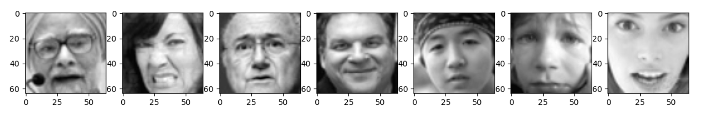
▲ Angry, Disgust, Fear, Happy, Neutral, Sad, Surprise

대충 각 분류에서 하나씩 출력해보자면 이런 이미지의 데이터셋인데, 벌써부터 Surprise나 Angry에서 오분류의 느낌이 느껴진다 ^^;..

### 사진 표정 분석 테스트

위의 데이터를 사용해서 Keras로 CNN을 구현하여 모델을 학습시켰다.

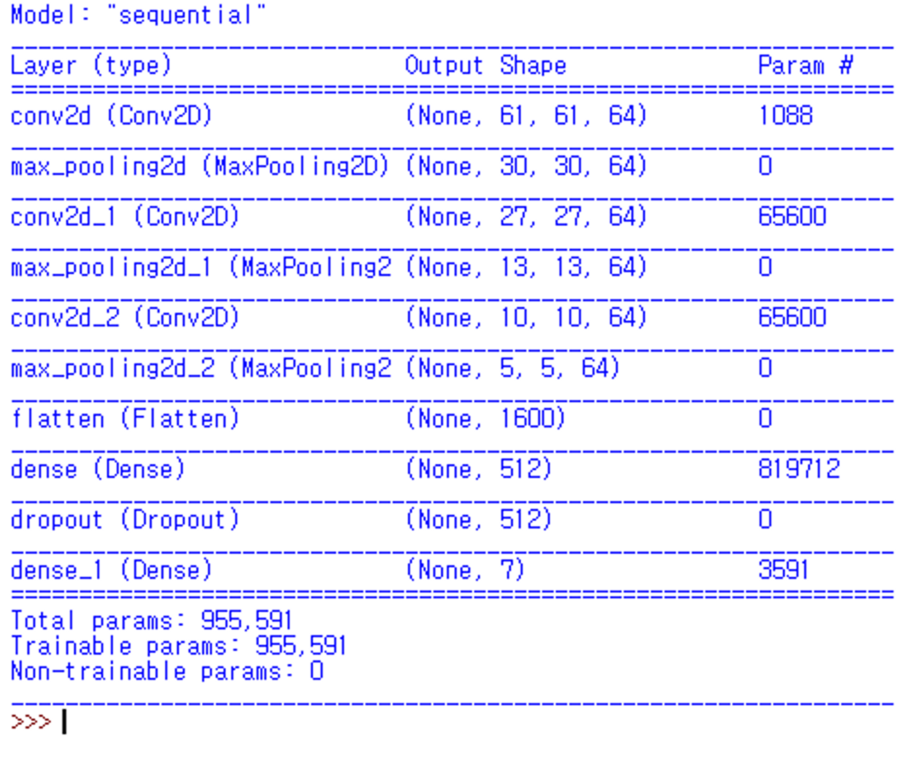
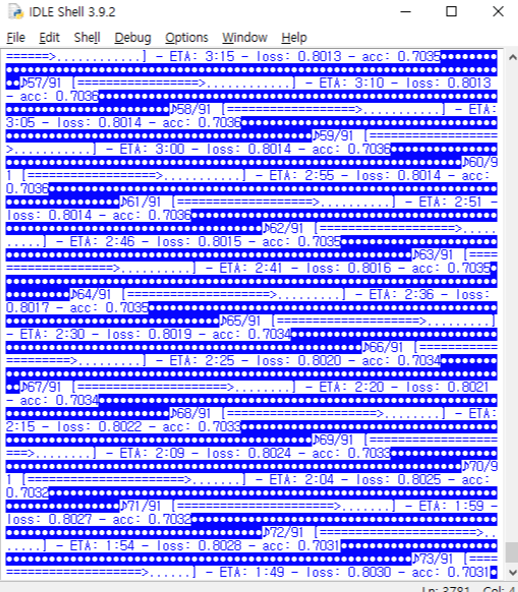
▲ 모델 요약 및 학습 진행 화면(4시간 소요)

Face API를 테스트하기 위해 썼던 드라마 사진으로 똑같이 테스트를 해보았다.

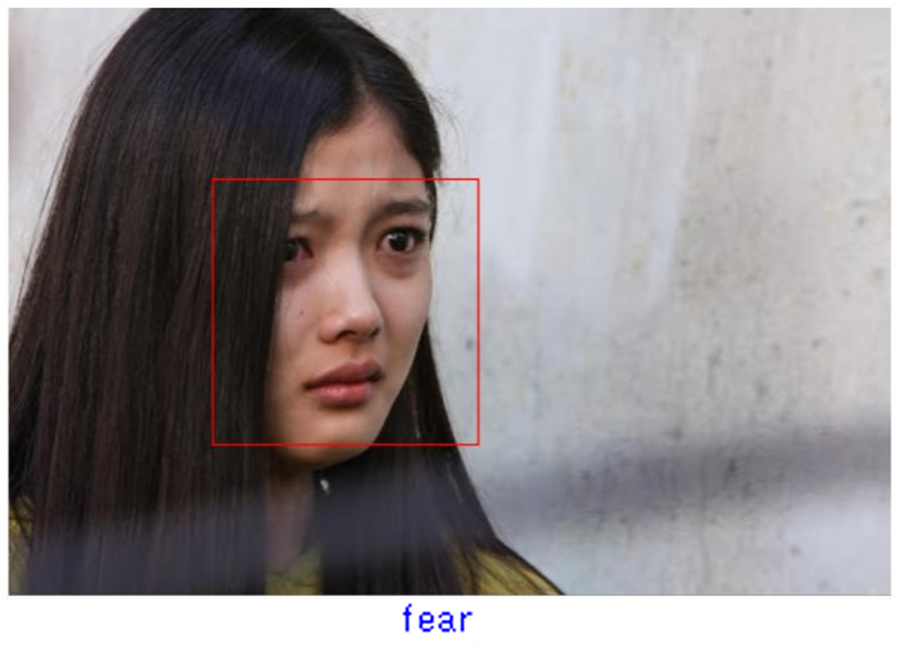
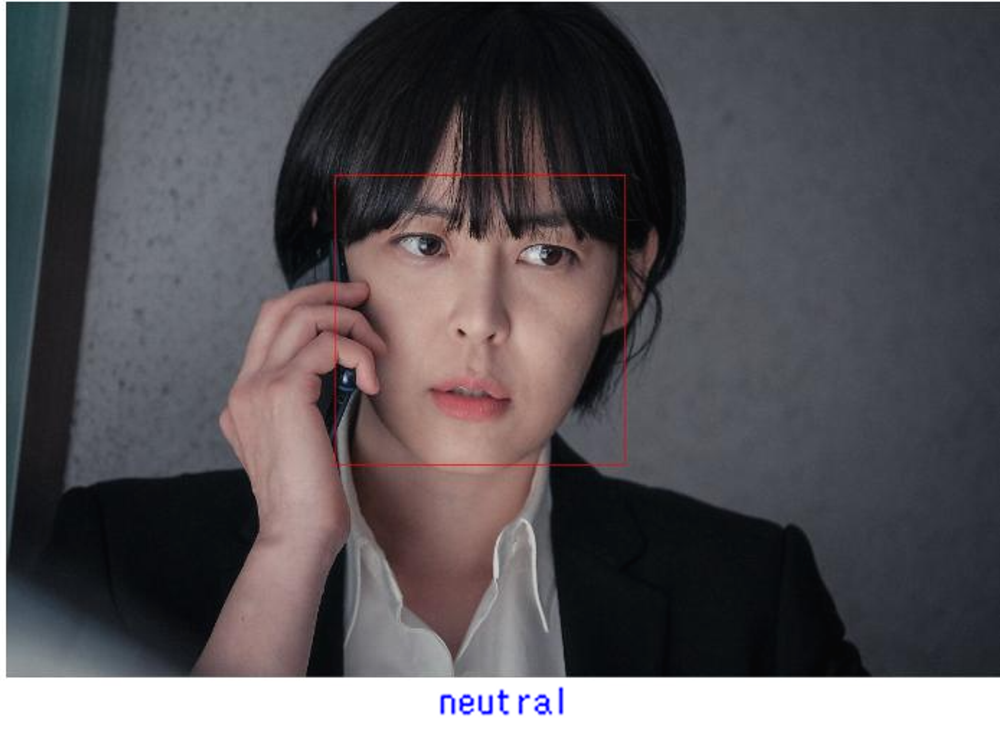

각각 sadness와 neutral이 0.9를 넘는 높은 수치로 나왔던 Face API와 비교했을 때, 슬픈 표정의 예시로 사용한 왼쪽 사진의 감정을 fear로 다르게 인식한 것을 확인할 수 있었다.

이 데이터셋을 사용한 여러가지 모델을 찾아보았을 때, 대략 정확도가 50%~70%정도로 나오는걸 알 수 있었다. 때문에 일부 데이터가 오분류 되어 있는게 정확도가 낮은 원인이 아닐까 생각된다.  
같은 데이터셋을 사용한 Kaggle 챌린지 best score의 상위권에 랭크한 코드 역시 test accuracy가 50% 정도로 나온 걸 확인할 수 있었다.

### 실시간 영상 분석 테스트

openCV를 활용하여 실시간 영상 표정 분석을 하는 코드도 실행을 시켜보았다. [**다음 링크**](https://m.blog.naver.com/roboholic84/221633210887)의 코드를 참고했다.

같은 캐글 데이터를 사용하지만 다른 구조를 갖고있는 모델을 사용했다.

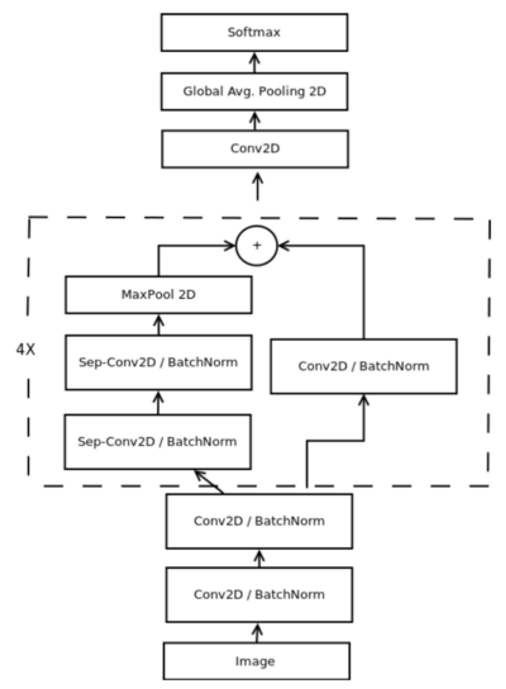
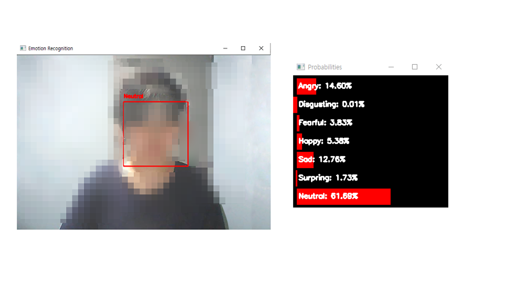

▲ 신경망 구조 및 실행화면(얼굴을 한껏 찌푸린 상태)

역시나 웹캠을 키고 직접 테스트해본 결과, 얼굴 일그러짐에 따른 Sadness는 잘 인식했던 Face API에 반해 Neutral로 오판하는 것을 확인할 수 있었다.

## 04 마무리

지금까지 프로젝트 간단 설명, Microsoft Azure Face API, 캐글데이터를 사용한 표정인식 방법을 알아보았다.

정리하자면 Face API와, 캐글 데이터를 사용하여 직접 학습시킨 모델을 각각 테스트 한 다음 비교해본 결과 **최종적으로 Microsoft azure의 Face API**가 우리 팀의 프로젝트의 표정 분석 파트의 기술로 채택되었다.

Face API의 경우에는 API라 얼굴 인식 자체의 정확도는 높일 수 없지만 감정 추출 주기를 조정하거나, 만약 단순 분류가 아니라 수치를 이용한다면 그 기준점 등을 조정해보면서 얼굴을 더 잘 인식할 수 있는 방법을 찾아볼 예정이다.

## 05 참고자료

- [https://www.kaggle.com/dencho143/face-emotion-classification-with-mlp-2-barykin](https://www.kaggle.com/dencho143/face-emotion-classification-with-mlp-2-barykin)
- [https://github.com/sunsmiling/facial-emotion-detector](https://github.com/sunsmiling/facial-emotion-detector)
- [https://github.com/SeoJinHyuk14/facialExpression](https://github.com/SeoJinHyuk14/facialExpression)
- [https://m.blog.naver.com/roboholic84/221633210887](https://m.blog.naver.com/roboholic84/221633210887)
- [https://electronicprogrammers.com/44](https://electronicprogrammers.com/44)
- [https://github.com/dinuduke/Facial-Emotion-Recognition](https://github.com/dinuduke/Facial-Emotion-Recognition)
