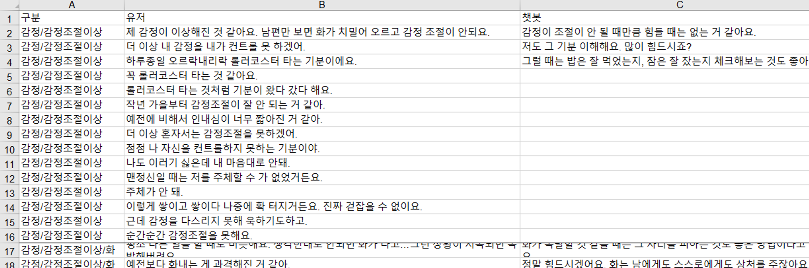
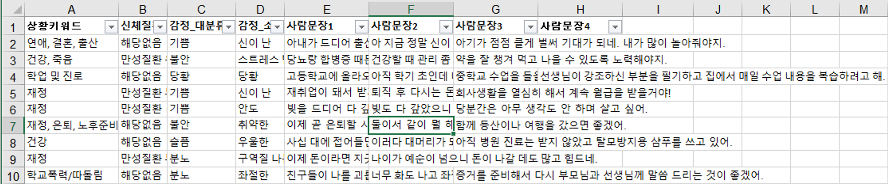
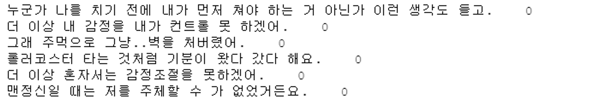
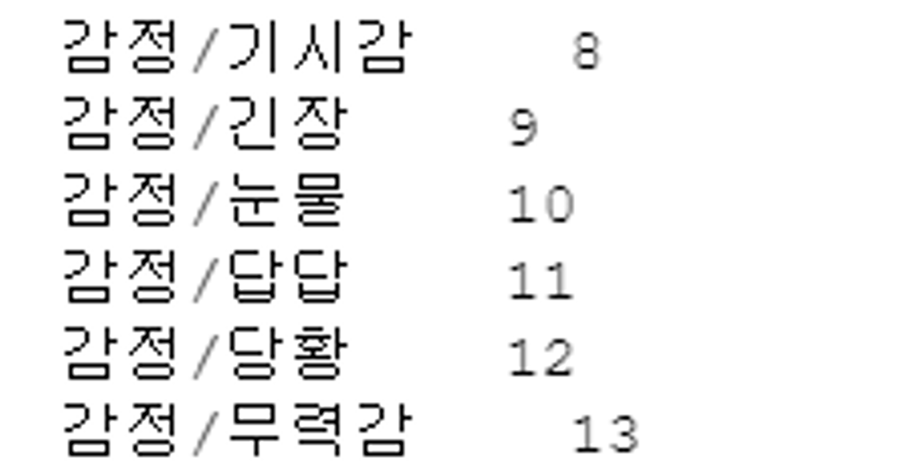
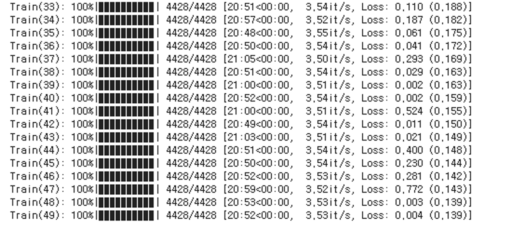
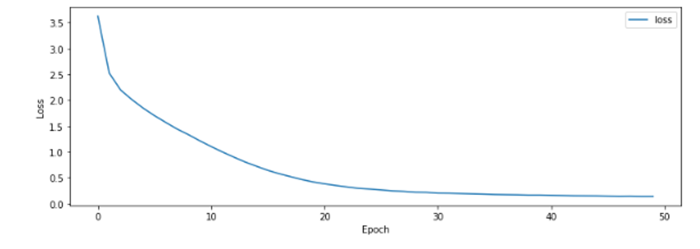
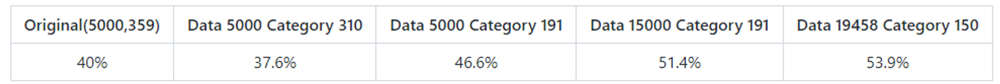

이번 편은 데이터 전처리와 KoBert를 사용한 챗봇 파트이다.

프로젝트 플로우에 따르면, [앞선 파트](https://suu3.github.io/Project/[2021-05-26][%EA%B0%90%EC%A0%95%EC%9D%B8%EC%8B%9D_%EC%B1%97%EB%B4%87_%EC%8A%A4%ED%94%BC%EC%BB%A4_'%EB%B2%84%EB%94%94'_%ED%94%84%EB%A1%9C%EC%A0%9D%ED%8A%B8]_%EC%96%BC%EA%B5%B4_%ED%91%9C%EC%A0%95_%EC%9D%B8%EC%8B%9D_%ED%8C%8C%ED%8A%B8/)의 Face recognition을 통해 사용자가 부정적인 감정 상태(anger, contempt, disgust, fear, sadness)에 있는 것으로 판단될 때 혹은 사용자가 시작을 원할 때 대화가 시작된다.

대화가 시작되면 스피커는 사용자의 발화에 맞는 위로의 답변을 출력한다. 이 답변 출력을 위한 챗봇 파트를 다뤄본다.

## 챗봇 모델 : KoBert? KoGPT2? KoELECTRA?

우리 팀에서는 버디의 챗봇 모델로 많이 쓰이는 세가지 한국어 모델, '**KoBert, KoELECTRA, KoGPT2**' 중 어떤 걸 버디의 메인 챗봇 모델로 사용할지에 대해 고민을 했다.

- KoBert와 KoELECTRA를 채택할 경우, 스피커는 사용자의 발화 의도를 미리 설정된 카테고리 중 하나로 분류하고 미리 작성된 답안을 출력하게 된다. (검색 모델)
- KoGPT2를 채택할 경우, 스피커는 사용자의 발화를 통해 답변을 새로 생성하게 된다. (생성 모델)

모델 결정을 위해 세 가지 모델을 직접 답변을 출력해 테스트해보았다.

여러가지 답변을 출력해보고 테스트해본 결과, KoGPT2가 상대적으로 두 모델에 비해 부자연스러운 답변을 도출하는 것을 확인할 수 있었다.  
또한 시중의 기존 챗봇들이 개인정보를 포함한 잘못된 답변을 생성하여 문제가 되는 일이 있었고, 버디는 감정을 다루는 챗봇인 만큼 답변 생성에 더욱 조심해야한다고 생각을 했다.

따라서 KoGPT2를 제외시키고 KoBERT와 KoELECTRA 중에서 고민한 결과, 자료가 더 많은 KoBERT를 채택하는 게 좋다는 조언을 받았고 최종적으로 KoBERT를 사용하기로 결정하게 되었다.

플로우를 정리해보면,

1. 스피커가 사용자의 발화를 STT 기술을 통해 텍스트로 변환하여 입력으로 받는다.
2. KoBERT가 그 발화의 상황을 미리 설정된 '상황 의도' 카테고리 중 하나로 classification 한다.
3. 각 카테고리에 미리 입력되어있는 답변 중 하나를 스피커가 출력한다.

가 될 것이다.

## 사용 데이터셋

1. [**웰니스 대화 스크립트 데이터셋**](https://aihub.or.kr/keti_data_board/language_intelligence)

   - 정신건강 상담 주제의 359개 대화의도에 대한 5,232개의 사용자 발화 및 1,023개의 챗봇 발화
   - 

2. **감성 대화 말뭉치** (https://aihub.or.kr/aidata/7978)

   - 일반인 1,500명을 대상으로 하여 음성 15,700문장 및 코퍼스 27만 문장 구축 및 세대별 감성 대화 텍스트 구축
   - 우울증 관련 언어 의미 구조화 및 대화 응답 시나리오 동반한 감성 텍스트 언어
   - 
   - 여기서 챗봇 발화는 삭제하여 사용했다. (앞선 대화의 맥락이 포함되어 있으므로)

정신건강과 질병을 다루고 있는만큼 사용할 데이터의 신뢰성에 대한 고민이 있었다.  
다른 크롤링 등의 방법으로 발화를 더 수집해볼까도 생각해봤으나, 그럴 경우 내 주관만으로 카테고리를 분류해야한다는 문제가 있었다.

직접 병원에서 수집한 위 두개의 데이터셋만으로도 양이 충분하고 신뢰성까지 확보할 수 있다고 생각하여 위의 두개의 데이터셋을 사용하기로 결정했다.

## 데이터 전처리

**웰니스 대화 스크립트 데이터셋**의 경우 카테고리 - 유저발화 - 챗봇 발화로 이루어져있어 챗봇발화를 쓰기 좋았던 반면 카테고리는 359개가 되는데 데이터가 5000개밖에 없다는 단점이 있었고  
**감성 대화 말뭉치**의 경우 데이터가 5만여개 있으나 카테고리 + 맥락이 존재하는 멀티 턴의 대화로 이루어져있어 현재의 우리팀 프로젝트에 적용하는건 불가능하다는 문제가 있었다.
(팀원들과 논의 결과, 스피커가 민감한 개인 정보 등을 잘못 학습하고 대답하는 것을 막기 위해 미리 정해진 범위 안의 대답을 출력하기로 결정했기 때문이다. 그렇기 때문에 대화하면서 사용자의 발화를 학습하는 기능을 넣지 않았다.)

다행히 두 데이터셋이 **우울증 관련 발화를 수집했다는 공통점을 갖고 있고, 둘 다 감정 카테고리가 나뉘어져 있었기 때문에** (수작업이 필요했지만) 합치기 좋았다.

두 데이터셋을 합쳐 데이터 양을 늘려 정확도를 높이되 카테고리 수 또한 줄여서 정확도를 높이라는 조언을 받았고, 학교 프로젝트인만큼 대상을 학생으로 좁혀 자녀나 시댁 갈등과 같은 카테고리들을 없애기로 했다.

감정 조절 이상, 분노 등 카테고리가 어울리고 챗봇 답변을 하나로 합칠 수 있는 카테고리를 하나로 묶었고 감성 대화 말뭉치와 웰니스 데이터셋의 카테고리를 비교하여 같은 감정 분류인 감성 대화 말뭉치 데이터들을 웰니스 안에 넣어주었다. (눈 빠져라 데이터셋을 확인하는 작업이 필요했다...)

합친 데이터셋을 학습시키기 위해

1. **유저 발화 + 카테고리 번호**

   - 

2. **카테고리 이름 + 카테고리 번호**

   - 

3. **카테고리 이름 + 챗봇 답변**
   - 

로 만들었다.

## 학습과 정확도

학습엔 17시간이 걸려서 이러저러 gpu 쓰는 데에 제한이 많은 Colab 무료판을 쓸 수 없었기에 Pro를 결제해야 했다. Pro는 한달에 12,000원 정도 요금이 든다.

앞에서 데이터셋을

1. 유저 발화 + 카테고리 번호
2. 카테고리 이름 + 카테고리 번호
3. 카테고리 이름 + 챗봇 답변

이렇게 나눴었는데, 1번 파일을 사용해 KoBERT를 학습시키면 새로운 유저 발화가 들어왔을 때 카테고리 번호를 출력하게 될 것이다.  
그 카테고리 번호를 이용해 2번 -> 3번으로 찾아가 답변 중 하나를 랜덤하게 출력할 것이다.

학습이 되고 있는 모습

epoch 50, batch 4일 때 Loss변화

데이터 19458개, 카테고리 150개 학습 결과

굉장히 따뜻한 답변을 출력해주는 모습을 확인할 수 있다..

여러번 학습시켜본 결과 데이터 양 & 카테고리 수에 따른 정확도는 다음과 같았다.

정확도를 높이기 위한 실험과 노력들..

정확도 테스트는 데이터셋을 **train : test = 10 : 1** 비율로 나눠서 맞는 카테고리를 찾아가는지 체크했다.
처음 40%에서 데이터셋 수작업 전처리 후 정확도를 약 14% 더 올릴 수 있었다.

정말 챗봇은 정확도 올리기 힘들구나.. 를 느꼈다. 데이터를 3배로 늘리고 카테고리를 거의 절반으로 줄여야 10%가 오르는..

하지만 정확도 테스트는 발화와 카테고리가 다대일로 매치되어있는 상황에서 맞는 카테고리를 찾았나? 를 체크한 것이고 실제로 사용자 발화는 다대다로 매치 될 수 있을 것이다.

예를 들어 "나 우울하고 힘들어" 의 경우, 감정/우울함에도 감정/힘듦 카테고리에도 들어갈 수 있다. (그렇다면 두 카테고리를 합치면 되지 않느냐? <- 우울함과 힘듦에는 분명히 차이가 있고 프로젝트가 심리안정 챗봇을 목표하고 있는만큼 여러가지 종류의 위로를 제공할 수 있어야한다고 생각했다.)

발화가 다대다로 매치된다면 정확도가 수치상으로 보는 것보다 실제로는 대답이 더 잘 맞아떨어질 것이다.

또한, 정확도를 높이려면 카테고리를 줄여야하지만, 반대로 카테고리를 줄어든다는 것은 기능이 떨어진다는 걸 의미했으니 절충안을 찾아야했다. 그래서 할 수 있는 최대한 사용 대상에 맞게, 또 희귀한 상황의 카테고리를 제거하고 나머지를 남기는 것으로 타협을 했다.
(++ 과적합을 고려하는 것 없이 정확도를 높이는 데만 집중할 수 있었는데, 이런 분류 모델 챗봇의 경우 과적합이 오히려 좋을 수도 있다는 조언을 들었다.)

### 학습을 돌리면서 겪었던 이슈

> RuntimeError: PytorchStreamReader failed reading zip archive: failed finding central directory

체크포인트가 손상되었을 때 나오는 에러이. 이전 상태를 복구시키든지 다시 학습하든지 해야한다 ㅎㅎ..

학습이 오래 걸려서 코랩으로 학습을 돌리고 자면 런타임 연결이 끊어지기 때문에
(런타임 연결이 끊어지면... 다시 시작해야하는 수가 있다)

자동으로 계속 콘솔 로그를 찍어내는 setInterval 등의 방법으로 꼭 방지를 해줘야한다.

## Wrap Up

여기까지 사용자와 버디가 대화를 나누는 챗봇 파트를 알아보았다.

사용자는 버디와 대화를 나누다가 사용자가 '종료'라고 말할 때 대화를 종료하게 될 것이다. 현재 정확도를 53.9%까지 끌어올렸지만 앞으로도 계속 더 높여볼 생각이다. 이제 버디 몸체 조립 후 실행시키는 일만 남은 듯하다.

## Reference

- [https://teddylee777.github.io/colab/google-colab-%EB%9F%B0%ED%83%80%EC%9E%84-%EC%97%B0%EA%B2%B0%EB%81%8A%EA%B9%80%EB%B0%A9%EC%A7%80](https://teddylee777.github.io/colab/google-colab-%EB%9F%B0%ED%83%80%EC%9E%84-%EC%97%B0%EA%B2%B0%EB%81%8A%EA%B9%80%EB%B0%A9%EC%A7%80)
- [https://github.com/nawnoes/WellnessConversation-LanguageModel](https://github.com/nawnoes/WellnessConversation-LanguageModel)
