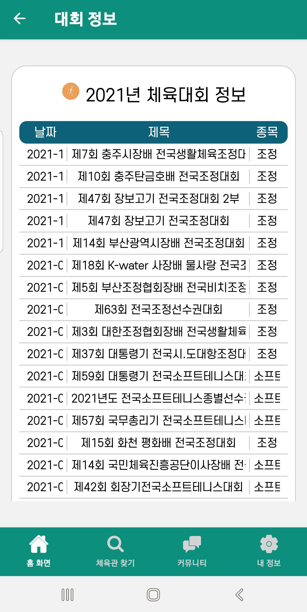

Gymt는 과 내 개발 경험 적은 몇명이서 모여서 기획하고, 프론트만 작업하고, 공모전 우수상을 수상했던 프로젝트이다. (+ 직접 디자인도 했다.)  
공모전 수상 후 학기가 시작됐고 좀더 하고싶은사람이 알아서 하자 하면서 팀이 뿔뿔이 흩어졌었는데, 학기가 바빠서 다시 손 못보고있다가 기껏 데이터셋 다 찾아놓고 데이터를 못 쓰고 끝난 게 계속 마음에 걸렸어서 뒤늦게 연결시켰다.

firebase 연결하고 데이터 가져오는 것은 생각보다 정말 쉬웠다.

해야할 일을 정리하자면 다음과 같이 세 가지가 있다.

1. 엑셀 파일을 json으로 변환
2. firebase에 프로젝트 / 앱 추가 후 json 데이터를 firebase에 import
3. DB를 가져와서 알맞게 렌더링

## 1. excel to json 변환

파일 변환 사이트는 검색 시 많이 나온다.  
나는 [**CSV to JSON**](https://csvjson.com/csv2json) 사이트에서 변환했다.

## 2. import

[**다음의 블로그**](https://copycoding.tistory.com/315)를 참고했다.

## 3. 데이터 가져오기

[**firebase 문서**](https://firebase.google.com/docs/firestore/)를 참고했다.

위 문서를 따라했다면, 2번 과정에서 firebase에서 프로젝트를 생성하고 js에 firebaseConfig를 복사해왔을 것이다.

```
import * as firebase from "./node_modules/firebase/app";
import { getFirestore } from "firebase/firestore"

const firebaseConfig = {
...
}

firebase.initializeApp(firebaseConfig);

const db = getFirestore();
export { db };
```

내 경우 initializeApp을 가져오려고 똑같이 `import { initializeApp } from "firebase/app";` 했을 때 모듈을 찾을 수 없다고 뜨는 이슈가 있어서 위와 같이 작성하였다.

그리고 데이터를 렌더링할 파일에 와서

```
import { db } from "../config";
import { collection, getDocs } from "../node_modules/firebase/firestore";
```

db와 콜렉션, getDocs를 가져오고

```
let contestList = [];
async function dbContest(contestList) {
  const querySnapshot = await getDocs(collection(db, "contest"));
  querySnapshot.forEach((doc) => {
    contestList.push({
      id : doc.data().id,
      date : doc.data().date,
      title: doc.data().title,
      sport : doc.data().kinds,
    });
  });
}
dbContest(contestList);
```

데이터 객체를 리스트에 추가했다.



그 결과 데이터가 잘 불러와진 걸 볼 수 있었다. 데이터가 제대로 들어가면서 오버플로우가 발생한 김에 scrollView로 바꿔주었다.

++


체육관 검색 결과 페이지도 잘 작동하는걸 확인할 수 있었다.
