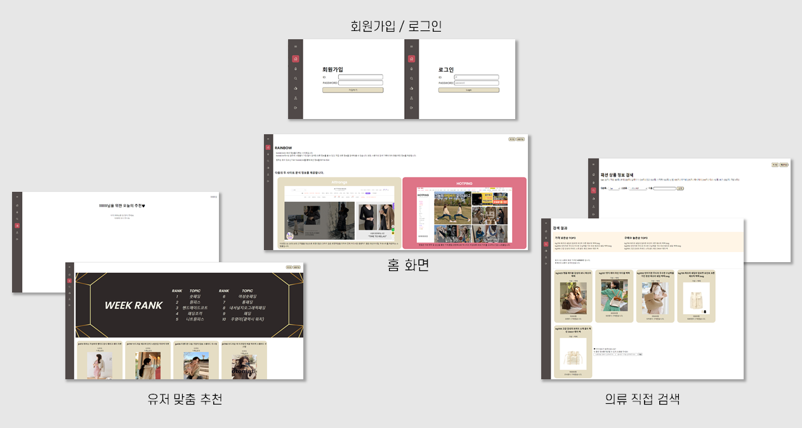

▲ 위 프로젝트에 사용된 코드이다.

코랩을 사용해 쇼핑몰 상품정보를 크롤링한 후 엑셀 형태로 저장해본다.

## 엑셀 저장

```python
import openpyxl
from google.colab import drive
drive.mount('/content/drive')# 경로 마운트

wb = openpyxl.Workbook()
```

엑셀 저장을 위해 openpyxl 라이브러리를 사용한다.

```python
sheet = wb.active
sheet_name =  ["카테고리1", "카테고리2", "카테고리3"]

for i in range(len(sheet_name)):
  sheet.cell(row=1, column=i+1).value = sheet_name[i]

wb.save('/content/drive/MyDrive/test.xlsx')
```

sheet.cell(row=1, column=1).value로 엑셀 칸 하나에 값을 저장한다. row랑 column은 1부터 시작해야한다.

**wb.save**로 엑셀 파일을 저장할수 있다.

## 크롤링

여기서부터는 크롤링 코드이다.

```python
import requests
from bs4 import BeautifulSoup

headers = {'User-Agent' : 'Mozilla/5.0 (Macintosh; Intel Mac OS X 11_0_1) AppleWebKit/537.36 (KHTML, like Gecko) Chrome/89.0.4389.82 Safari/537.36'}

def getPageString(url):
    data = requests.get(url, headers = headers)
    return data.content
```

HTML 문서를 긁어올 때는 BeautifulSoup 라이브러리를 사용한다.

```python
big_cate = ['###', '###', '###']
big_cate_name = ['###', '###', '###']

for i in range(len(big_cate)):
  url = f'https://쇼핑몰 주소?cate={big_cate[i]}'

  data = getPageString(url)
  bsObj = BeautifulSoup(data, "html.parser")

  b_ul = bsObj.find("div", {"class":"###"})
  b_li = b_ul.findAll("li")

  small_cate = []
  small_cate_url_num = []#초기화for item in b_li:
    b_a = item.find("a", {"class" : "###"})
    small_cate.append(b_a.get_text())
    small_cate_url_num.append(b_a.get("###").split('-')[-1])

  for j in range(len(small_cate)):
    url = f'https://쇼핑몰 주소?cate={small_cate_url_num[j]}'
    data = getPageString(url)
    bsObj = BeautifulSoup(data, "html.parser")

    ul = bsObj.find("ul", {"class":"###"})# 상품 리스트
    lis = ul.findAll("li", {"class":"###"})#각 상품

    write_excel(big_cate_name[i], small_cate[j])
```

큰 메뉴, 작은 메뉴마다 필요한 정보를 긁어올 건데, 두 url이 달라 작은 메뉴를 탐색할 때 url을 한번더 갱신하기로 했다.

big_cate에는 메뉴마다 url에서 바뀌는 부분이 있는데 그걸 넣어줬다. 바뀌는 부분이 규칙이 없어서 그냥 직접 리스트에 넣어줬다. big_cate_name에는 대응되는 메뉴 한글 이름을 넣어줬다. (나중에 엑셀에 쓰기 위해..)

small_cate에는 작은 메뉴 이름을, small_cate_url_num에는 url에서 작은 메뉴가 바뀔 때마다 달라지는 부분을 넣어줬다.

이제 큰 메뉴& 작은메뉴마다 상품을 긁어올 수 있다.

html 태그를 찾을 땐 BeautifulSoup(data, "html.parser").find("태그이름")을 쓴다.

- **find("태그이름")**를 쓰면 동일 태그가 여러개면 제일 처음 찾은 것이 반환되며, **findAll**을 쓰면 리스트가 만들어진다.
- **find("태그이름", {"class":"클래스이름"})**으로 특정 클래스를 갖는 태그를 가져올 수 있다.
- **get("attribute")**로 속성값을 얻어올 수 있다.

```python
def write_excel(big_cate_name, small_cate):
  for item in lis :
    print_array = []

# 큰 메뉴 이름
    print_array.append(big_cate_name)

# 작은 메뉴 이름
    print_array.append(small_cate)

    '''
    클래스 구조 : class1 > class2 > class3
    '''
    class1 = item.find("div", {"class": "class1"})
    class2 = class1.find("div", {"class": "class2"})
    class3 = class2.find("span", {"class": "class3"}).get_text()

    print_array.append(sell)

    sheet.append(print_array)
```

```python
wb.save('/content/drive/MyDrive/test.xlsx')
```

**get_text()**로 태그 안 텍스트를 가져올 수 있다.
print_array에 한 행에 쓸 값들을 저장하고, sheet.append()로 엑셀 sheet에 써주었다.
마지막으로 save를 해야 제대로 저장된다.
