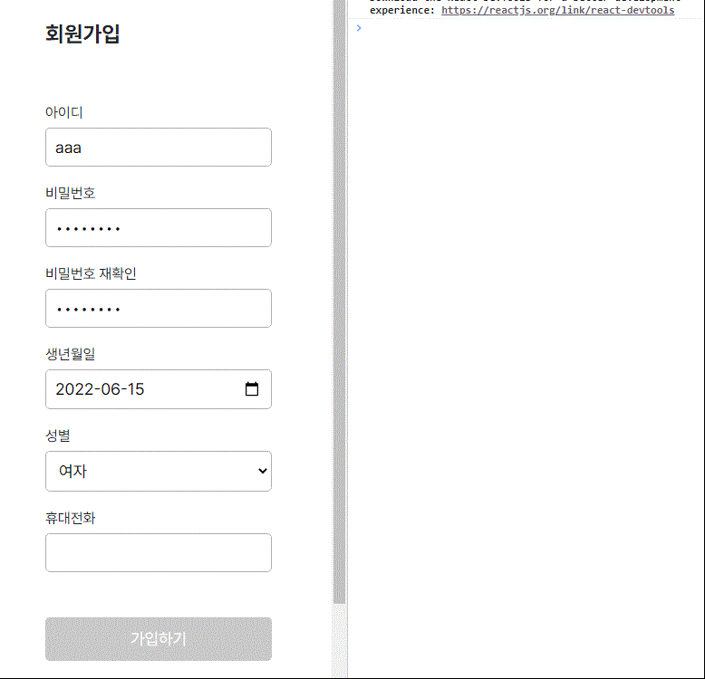

이런걸 만들어본다

### **0. 들어가기 앞서**

React 문서 Form 파트에는 다음과 같은 문항이 있다.


마침 회원가입 창 폼 유효성 검사 처리를 하지 않았기에 Formik을 써봐야겠다고 생각을 했으나

**[https://nyeongnyeong.tistory.com/299](https://nyeongnyeong.tistory.com/299)**

[
[React] Form Validation (Formik VS React Hook Form)
Validation 이란? 서버에 데이터를 제출하기 전에 양식이 올바른지 확인하는 과정 사용자가 데이터를 목적지로 보내기 전에, 올바를 데이터를 입력했는지 유효성을 체크해주는 것. Client Validation rea
nyeongnyeong.tistory.com](https://nyeongnyeong.tistory.com/299)

위의 Formik과 React Hook Form을 비교한 글을 읽고 React Hook Form을 쓰기로 결정!

**[https://react-hook-form.com/kr/get-started](https://react-hook-form.com/kr/get-started)**

[
시작하기
Performant, flexible and extensible forms with easy-to-use validation.
react-hook-form.com](https://react-hook-form.com/kr/get-started)

문서가 정말 잘 정리되어있다. 한국어도 지원해주고, 버전별 & TS JS 별 코드도 제공해준다.

오늘 문서 좀 보고 바로 적용할 수 있을 정도로 러닝커브가 낮다고 느꼈다.

```
npm install react-hook-form
```

```jsx
import { useForm } from "react-hook-form"

const {
  register,
  reset,
  watch,
  getValues,
  handleSubmit,
  formState: { errors },
} = useForm()
```

react hook form은 비제어 컴포넌트를 사용한다.

물론 UI 라이브러리를 사용해서 제어 컴포넌트를 쓰고 있을 때도 조합해서 사용이 가능하다. (React hook form #ControlledmixedwithUncontrolledComponents 참고 )

사용한 함수들은 위와 같다. 하나씩 살펴본다.

[](https://temp-ha3.tistory.com/146#%C-%A-)

### **1. handleSubmit & reset**

```
const onSubmit = (data) => {
    console.log(data);
    reset();
};

return(
    <form onSubmit={handleSubmit(onSubmit)}>
        ...
    </form>
);
```

폼 태그가 Submit 될 때 호출될 함수를 handleSubmit에 콜백으로 넣어준다.

e.preventDefault() 할 것 없이 유효성을 통과하지 못하면 제출되지 않는다.

reset()은 폼을 초기화 시켜준다.

**[https://react-hook-form.com/kr/api#reset](https://react-hook-form.com/kr/api#reset)**

특정 필드만 초기화시켜줄 수 있고, 특정 값으로 초기화시켜주는 등 다양한 작업이 가능하다.

[](https://temp-ha3.tistory.com/146#%C-%A-)

### **2. register & errors**

```jsx
const SignUp = () =>{

    return (
        ...
        <CustomInput
            label="아이디"
            eLabel="id"
            register={register}
            confirm={idConfirm}
            type="text"
            required
        />
        ...
    );
}

//Custom Input
const CustomInput = ({ type, label, eLabel, register, confirm }) => {
  return (
    <div>
      <label htmlFor={styles.input}>{label}</label>
      <input
        maxLength={20}
        {...register(`${eLabel}`, confirm)}
        type={type}
        className={styles.input}
        autoComplete="false"
      />
    </div>
  );
};
```

register를 ref={register(...)} 로 작성하면 다음과 같은 에러가 날 수 있는데

**[https://stackoverflow.com/questions/66927051/getting-uncaught-typeerror-path-split-is-not-a-function-in-react](https://stackoverflow.com/questions/66927051/getting-uncaught-typeerror-path-split-is-not-a-function-in-react)**

버전 문제이므로 {...register} 이렇게 작성해주자.

register는 input에 ref를 등록해준다고 볼 수 있을 것 같다. (unregister로 등록을 취소할수도 있다.)

register의 첫번째 인자로는 객체 프로퍼티의 키 값이 될 문자열이 들어간다. 이 키 값으로 input 개별 처리를 한다.

confirm에는 유효성 체크 객체를 보내주었다.

예를 들어 id의 confirm은 이렇게 보내주었다.

```jsx
const idConfirm = {
  required: "필수 항목입니다.",
  minLength: { value: 4, message: "4자 이상 입력해주세요" },
  pattern: {
    value: /[a-z0-9_]{4,10}$/,
    message: "아이디는 영어 혹은 숫자로 이루어져야합니다.",
  },
}
```

**required:** 입력여부 체크

**minLength:** input 최소 길이 만족했는지 체크

**pattern:** 정규식 체크

각 키 별로 value, message를 설정해줄 수 있다.

message는 value조건을 만족하지 않을 때 errors 객체로 보내진다.

```jsx
<CustomInput
        label="아이디"
        eLabel="id"
        register={register}
        confirm={idConfirm}
        type="text"
        required
/>
<p>{errors.id?.message}</p>
```

**errors.[register 첫번째 인자로 들어간 키 값].message**로 출력할 수 있다.

위에서는 4자 이하 값이 submit 됐을 때 "4자 이상 입력해주세요" 메세지가 출력될 것이고

특수 문자가 들어가면 "아이디는 영어 혹은 숫자로 이루어져야합니다" 메세지가 출력될 것이다.

### [](https://temp-ha3.tistory.com/146#%C-%A-)

### **3. getValues()**

```jsx
const rePasswordConfirm = {
  required: "필수 항목입니다.",
  validate: {
    matchPassword: value => {
      const password = getValues("password")
      return password === value || "비밀번호가 일치하지 않습니다."
    },
  },
}
```

getValues()는 register된 모든 input들의 값을 가져올 수 있다.

역시나 특정 값은 register 첫번째 인자로 가져올 수 있다.

validate는 콜백이나 콜백의 객체를 전달해서 검증할 수 있다.

여기를 참조했다. (**[https://velog.io/@bomboming/React-Hooks-Form%EC%9D%84-%EC%82%AC%EC%9A%A9%ED%95%9C-%EC%9C%A0%ED%9A%A8%EC%84%B1%EA%B2%80%EC%82%AC](https://velog.io/@bomboming/React-Hooks-Form%EC%9D%84-%EC%82%AC%EC%9A%A9%ED%95%9C-%EC%9C%A0%ED%9A%A8%EC%84%B1%EA%B2%80%EC%82%AC)**)

### [](https://temp-ha3.tistory.com/146#%C-%A-)

### [](https://temp-ha3.tistory.com/146#%C-%A-)

### **4. watch**

```jsx
React.useEffect(() => {
  const subscription = watch((value, { name, type }) =>
    console.log(value, name, type)
  )
  return () => subscription.unsubscribe()
}, [watch])
```

watch는 input의 값들을 계속 관찰한다. unsubscribe()로 관찰을 풀어줄 수 있다.

getValues랑 다른 점은 getValues는 useEffect의 dependency array에 넣어도 변화가 감지되지 않는다.

나는 input들이 전부 입력되면 버튼에 색이 들어오게 만들어주고 싶었기 때문에 watch를 사용했다.

### 사용 후기

쓰기도 쉽고 원하는대로 유효성 검사 만들 수도 있고 좋았다.

form같이 한꺼번에 여러 상태를 관리해야할 때 사용하면 좋을 듯 하다.
