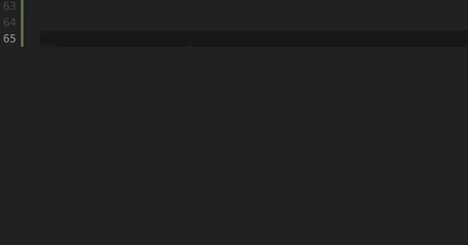
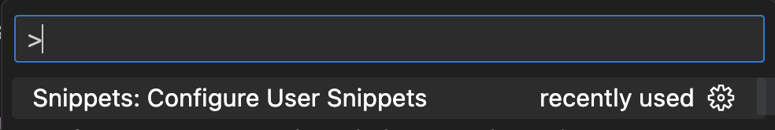
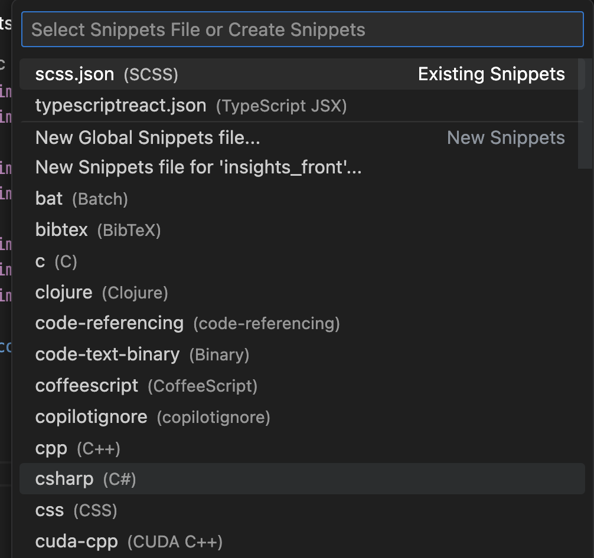
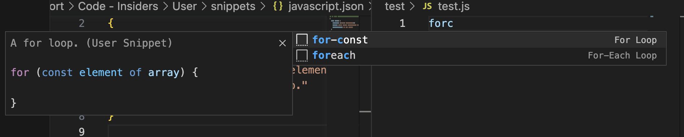
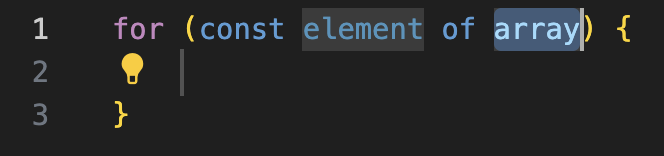
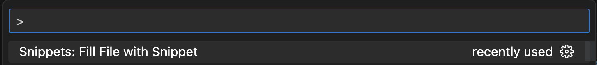
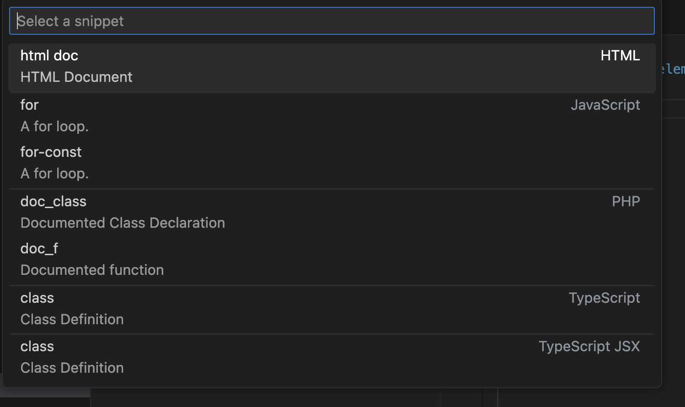
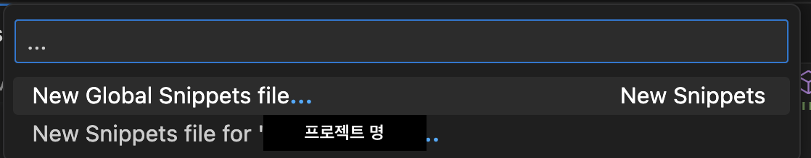

## Introduction

[https://code.visualstudio.com/docs/editor/userdefinedsnippets#\_variables](https://code.visualstudio.com/docs/editor/userdefinedsnippets#_variables)

> Code snippets are templates that make it easier to enter repeating code patterns, such as loops or conditional-statements.

코드 스니펫은 작은 코드 조각들이라는 뜻으로, 개발자들이 자주 사용하는 패턴이나 기능을 입력하기 쉽게 해주는 템플릿들을 말한다.



VSC에서 기본 제공하는 스니펫 중 for을 예시로 보자면, for만 입력했는데도 for문이 완성이 되었다.

이처럼 코드 스니펫을 사용하면 의미없는 반복되는 타이핑을 줄이고 개발 속도를 높일 수 있다.

나는 기존에도 익스텐션을 통해서 리액트 스니펫 등을 사용하고 있었지만, 기본 스니펫들과 익스텐션 외에도 유독 자주 반복해서 쓰게 되는 훅들이 있어서 추가로 스니펫으로 등록해서 쓰고 있다. (특히 CSS media-query 설정할 때 잘 쓰고 있다.)

스니펫의 종류엔 VSC Docs에서 설명하듯이 3가지가 있는 것 같다.

1. 빌트인 스니펫 (VSC 기본 스니펫)
   1. 여러 언어에 대해 기본적으로 VSC에서 스니펫을 제공한다.
2. 익스텐션 사용
   1. 자신이 사용하는 언어나 프레임워크, 라이브러리에 맞게 익스텐션을 설치한다. 나는 React랑 emotion snippets 등등을 설치해서 쓰고 있다.
3. 사용자 정의 스니펫

이 중에서 3번 설정 방법에 대해 알아보자.

## 1. 프로그래밍 언어에 따라 설정하기

1. `command + shift + p`
   

2. 스니펫 삽입할 언어 선택
   

3. 스니펫 작성

   ```json
   {
     "For Loop": {
       "prefix": ["for", "for-const"],
       "body": ["for (const ${2:element} of ${1:array}) {", "\t$0", "}"],
       "description": "A for loop."
     }
   }
   ```

만약 javascript.json에서 이렇게 설정했다면, 자바스크립트 파일에서 prefix를 입력했을 때 다음과 같이 나타나게 된다.




$1, $2 …는 자리를 지정하는 숫자로, 탭을 통해 순서대로 이동할 수 있다. $0은 항상 마지막에 온다.

${2:element}로 기본적으로 입력될 텍스트를 설정할 수 있다.

### isFileTemplate

```jsx
{
  "For Loop": {
    "prefix": ["for", "for-const"],
    "body": ["for (const ${2:element} of ${1:array}) {", "\t$0", "}"],
    "description": "A for loop.",
    **"isFileTemplate": true**
  }
}
```

만약 isFileTemplate: true속성을 쓴다면 파일 템플릿으로서도 활용할 수 있다.

1. command palette를 열고 (`command + shift + p`)

   

2. Fill File with Snippet을 선택하면 for-const 스니펫이 있는걸 확인할 수 있다. 선택 시 파일이 해당 스니펫 내용으로 덮어씌워진다.

   

## 2. 프로젝트 별 설정하기

프로젝트별 스니펫은 2018년에 새로 생긴 기능이라고 한다. (version 1.28)([https://code.visualstudio.com/updates/v1_28#\_project-level-snippets](https://code.visualstudio.com/updates/v1_28#_project-level-snippets))

1. `command + shift + p`

   

2. …을 입력해서 전역 스니펫 파일을 만들거나 프로젝트 안 스니펫 파일을 만들 수 있다

   

파일 이름을 입력하면 `파일이름.code-snippets` 파일이 .vscode 폴더 안에 생성된다.

## Reference

- [https://code.visualstudio.com/docs/editor/userdefinedsnippets#\_how-do-i-have-a-snippet-place-a-variable-in-the-pasted-script](https://code.visualstudio.com/docs/editor/userdefinedsnippets#_how-do-i-have-a-snippet-place-a-variable-in-the-pasted-script)
- [https://stackoverflow.com/questions/44312494/how-to-create-per-workspace-snippets-in-vscode](https://stackoverflow.com/questions/44312494/how-to-create-per-workspace-snippets-in-vscode)
