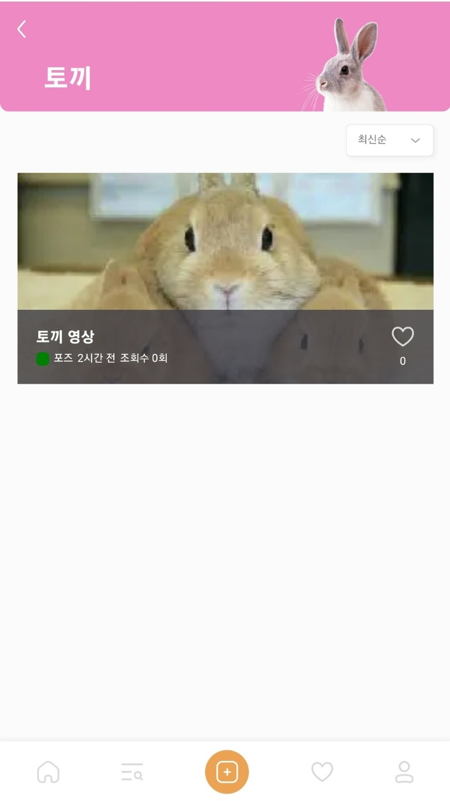
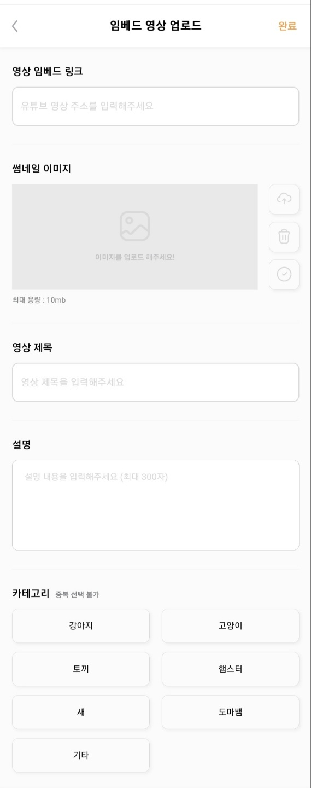
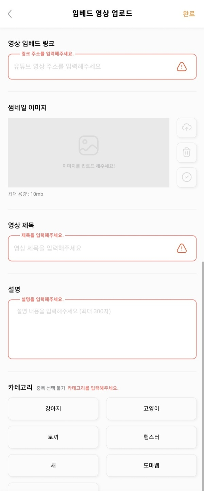
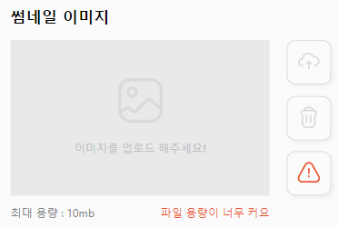

## ✨ Introduction

넘블 디자인-프론트-백엔드 연계 모바일용 웹 서비스 만들기 챌린지 회고록.

### 💡 참가 동기

우연히 들어가있던 단톡방에서 이런 챌린지가 열린다는 것을 알게 되어 참가하게 되었다.

다른 프레임워크로 팀플은 많이 해봤는데 리액트로 팀 프로젝트를 해본 적이 없다는 점이 계속해서 고민이었고, 장고로 같은 서버에서 백 프론트 혼자서 데이터 주고받는건 해봤는데 백과 프론트가 완전히 분리되었을 때 데이터를 어떻게 주고받는지 해본 적이 없어서 성장에 큰 도움이 될 것 같았다.

마침 신청 당시 일정이 비어있어서 망설임 없이 참가했다. (하지만 프로젝트 시작후 갑자기 많은 일정이 생겨버려 고생을 좀 하게 됨...^^)

결론적으로 말하면 그동안 프론트 개발자분들과 얘기할 기회가 없었는데, 이번에 얘기하면서 새로운 기술들도 많이 알아가고 많이 배울 수 있었다. 정말정말 만족한다! 🥰

### 💡 챌린지 소개

모바일용 숏 폼 웹 서비스를 만드는 챌린지. 우리 팀은 '**짧은 반려 동물 영상을 업로드 하는 모바일용 플랫폼**'을 주제로 정했다. 동물을 키우지 않아도 서비스를 이용할 수 있기 때문에 이용자를 많이 확보할 수 있을 거라 생각했다.

사이트 이름은 Paws (발바닥들이라는 뜻과, 영상 pause 두가지를 의도한... 디자이너님의 멋진 아이디어 👍)

**Github :** **[https://github.com/Numble3/Paws-Frontend](https://github.com/Numble3/Paws-Frontend)**

## ✨ 담당 역할 및 코드

동영상 업로드, 동영상 목록, 댓글 작성, 좋아요를 맡았다.

### 동영상 목록 (무한 스크롤)



```tsx
function InfiniteScroll({
  noResult = {
    title: "검색 결과 없음",
    content: "아직 등록된 동영상이 없어요",
  },
  query = { page: 0, size: 10 },
  fetchFunc,
  selectedCategory,
}: Props) {
  const [target, setTarget] = useState<HTMLDivElement | null>(null)
  const [isLoaded, setIsLoaded] = useState(false)
  const [data, setData] = useState<any>([])
  let page = query.page
  let hasNext = true
  const getMoreItem = async () => {
    setIsLoaded(true)
    await fetchFunc({ ...query, page: page }).then(res => {
      hasNext = res.hasNext
      setData((prev: VideoListType[]) => {
        const newData = prev.concat(res.contents)
        return newData
      })
    })
    page++
    setIsLoaded(false)
  }
  useEffect(() => {
    setData([])
    query = { ...query, sort: selectedCategory }
  }, [selectedCategory])
  const onIntersect = async (
    [entry]: any,
    observer: { unobserve: (arg0: any) => void; observe: (arg0: any) => void }
  ) => {
    if (entry.isIntersecting && !isLoaded) {
      observer.unobserve(entry.target)
      await getMoreItem()
      if (!hasNext) {
        return
      }
      observer.observe(entry.target)
    }
  }
  useEffect(() => {
    let observer: IntersectionObserver
    if (target) {
      observer = new IntersectionObserver(onIntersect, {
        threshold: 0,
      })
      observer.observe(target)
    }
    return () => observer && observer.disconnect()
  }, [target, selectedCategory])
  return (
    <>
      <section style={{ display: "grid", gap: "20px" }}>
        {data && data.length !== 0
          ? data.map((value: VideoListType, index: any) => {
              return <Video key={index} data={value} />
            })
          : !isLoaded && <NoResult {...noResult} />}
        <div ref={setTarget} id="loading">
          {isLoaded && (
            <div>
              <Image src={ICONS.LOADING} width={25} height={25} />
            </div>
          )}
        </div>
      </section>
    </>
  )
}
```

재사용을 신경 써야 했기 때문에 query, fetchFunc, 페이지마다 맞는 문구를 보여주기 위한 noResult, 최신순/인기순 정렬 기준 <- 이렇게 네 가지를 props로 받는다.

하면서 깨달은 것은 생각없이 쿼리에 타입을 작성해주고 있었는데 재사용 가능하게 해주려면 다 any로 지정해줘야한다는 것.

어려웠던 점은 처음엔 프로젝트 내에서 react-query를 쓰고 있었기 때문에 infinite query(다음 페이지가 있으면 fetch를 다시한번 호출해준다.)를 사용해서 infinite scroll을 구현하려고 했었는데

infinite query의 hasNextPage나 백에서 response로 받은 hasNext가 undefined로 떠 observer가 풀리지 않았다 😂

결국 react query는 빼고, observe를 로딩 div에 걸고 hasNext가 true이면 계속 observe를 걸게 했다. useEffect로 카테고리가 변경되면 다시 데이터를 불러온다.

### 동영상 업로드



사용자의 행동을 고려한 부분을 얘기하려면 업로드 부분을 얘기해야할 것같아서 주요 코드만 꺼내본다.

업로드 부분은 사용자의 행동에 따라 post를 막아야 할 경우가 많았다.

```tsx
//입력 체크
if (linkLoading) return
if (linkInfo.link === "") {
  setLinkInfo(prev => {
    return {
      ...prev,
      linkError: { message: "링크 주소를 입력해주세요.", isError: true },
    }
  })
}
if (titleInfo.title === "") {
  setTitleInfo(prev => {
    return {
      ...prev,
      titleError: { ...prev.titleError, isError: true },
    }
  })
}
if (imageFile === null) {
  setImageError(true)
}
if (descriptionInfo.description === "") {
  setDescriptionInfo(prev => {
    return {
      ...prev,
      descriptionError: { ...prev.descriptionError, isError: true },
    }
  })
}
if (selectedCategory === "") {
  setCategoryError(true)
}

if (
  linkInfo.link === "" ||
  titleInfo.title === "" ||
  imageFile === null ||
  descriptionInfo.description === "" ||
  selectedCategory === ""
)
  return
```

"완료" 버튼을 누르면 실행되는 코드 부분이다.

만약 빈칸이면 return으로 나온다. 리턴 하기 전에는 각 input마다 사용자에게 경고 문구를 보여주는 로직이 필요했다. 팀원 분이 만들어주신 custom input을 사용했기 때문에 형식만 맞춰서 에러 문구와 에러 여부, 성공 여부만 보내주면 되었다.



이미지는 용량이 맞지 않으면 파일이 업로드 되지 않고 경고문구가 출력된다.



업로드 된 이미지는 리사이즈를 위해 먼저 post 되어 백에서 변환이 된다. 변환된 주소가 response로 들어온다.

```tsx
await imageResize(image)
  .then(response => {
    imageSrc = response.url
  })
  .catch(e => {
    setLoading(false)
    router.replace("/")
  })
```

```tsx
await createEmbedVideo(data)
  .then((res) => {
    router.replace("/profile/my-upload");
  })
  .catch(() => {
    router.replace("/");
  });
setLoading(false);
};
```

post 성공시 내 업로드 영상 페이지로, 실패시 홈으로 돌아간다.

이 모든 업로드를 위한 체크가 끝날 때까진 로딩 페이지가 렌더된다.

---

## ✨ 소감 및 보완할 점

나에게 이 프로젝트는 첫 리액트 팀 프로젝트이자 첫 백&프론트 분리 프로젝트이자 첫 Next이자 첫 상태관리이자... 등등이다. (+ tailwind나 material ui도 처음 알게 됐다.)

상태 관리를 서버와 클라이언트 나눠서 할 수 있다는 것도 배워간다. 👀

찍먹한 느낌이지만 이런게 있다는 걸 알게 된 것 만으로도 앞으로 뭘 공부하면 좋을지 정해져서 좋다.

넘블에서 제시한 프로젝트 기간은 끝났지만, 좀 더 해야할 것들이 많아 팀원들과 같이 더 해보기로 했다.

추후 할일들

- 팀원 분이 내가 맡은 페이지 중 하나를 SSG로 만들면 어떻겠냐고 감사한 제안을 주셨는데, Next를 써본 만큼 도전해볼것.
- 백과 좋아요나 조회수 로직 재협의
- youtube 임베드 가능 여부 체크 CORS 해결
