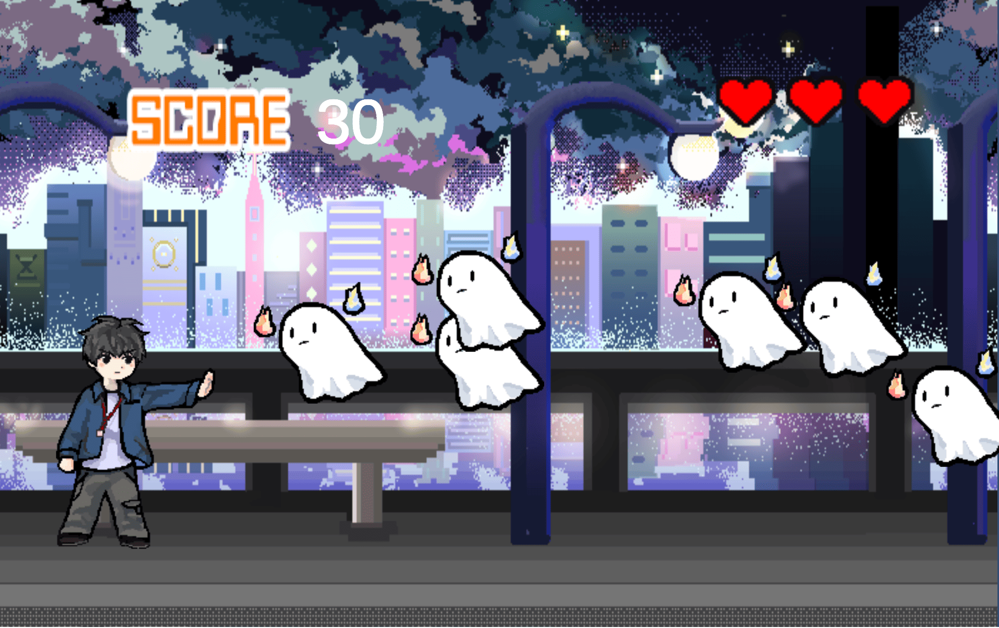

최근에 유니티도 WebGL로 웹 배포가 가능하다는 걸 알게 됐다 (그것도 gh-page로!)

그래서 일 년 전에 만든 유니티 프로젝트로 배포해보기로 했다.

이 프로젝트는.. 개발을 접한 초기에 게임 개발자를 진로로 잡고 책 보면서 만들었던 것이다. (지금은 웹 개발 쪽으로 갔지만...)

사실 이때 aseprite라는 픽셀 아트 프로그램에 빠져있었어서 픽셀 아트를 그리고 싶어서 만들게 된 게 더 컸다. (개발은 이용당함.) 실제로 코드 작성 부분은 몇 시간 안 걸렸고 도트 그리는 게 힘들었던 기억이 있다. ㅎ.

## 배포 방법

1. **WebGL 설치**

   - File - Build Setting - Platform에서 WebGL을 찾는다. 설치하지 않았으면 install with Unity Hub 버튼이 보일 것이다.

2. **Switch Platform**

3. **Build**
   - 체크 없이 바로 빌드

빌드 된 파일을 깃헙에 올려 gh-page 설정을 하면 된다.

## 겪은 문제

1. **.exe did not run properly!**

내 경우 경로명에 한글이 들어간 게 문제였다.

컴퓨터 관리자 폴더명이 한글로 되어 있어서 종종 문제가 생기는데 쓴 지 오래된 컴퓨터라 수정하기 곤란해서 다른 컴퓨터로 옮겨서 해결했다. ㅠㅠ 언제 한 번 싹 바꿔야지 하는 생각.

2. **Unable to parse Build/[File Name].framework.js.br**

gh-page 배포하고 들어갔더니 이런 내용의 콘솔 에러 창이 떴다.

[**여기**](https://forum.unity.com/threads/solved-webgl-build-error-unable-to-parse-build-file-name-framework-js-br.1102759/) 나온 것처럼 나도 Player의 Compression Format을 disabled로 바꿔서 해결했다.

댓글에 3D 프로젝트로 생성하면 이런 오류가 안 생긴다는 말도 있는데, 나도 2D로 생성했긴 함.

[**웹으로 띄운 결과물 🥳🎉**](https://suu3.github.io/EliminateGhost/WebGL/)
