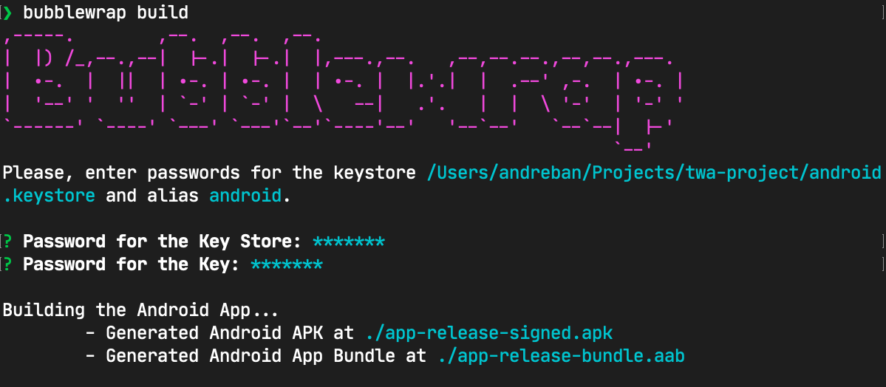
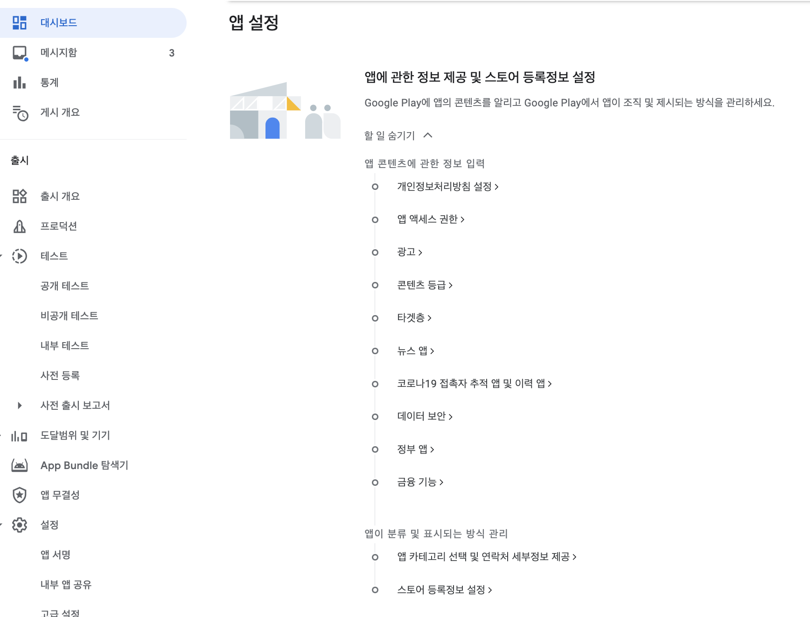
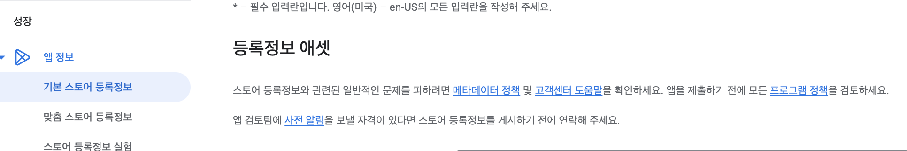
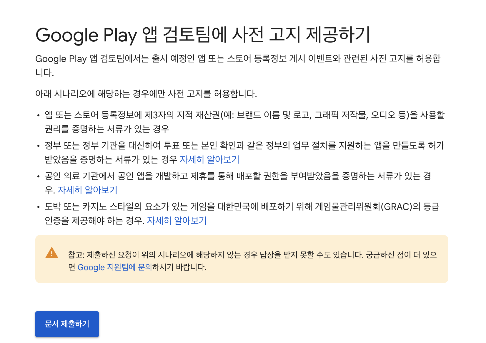
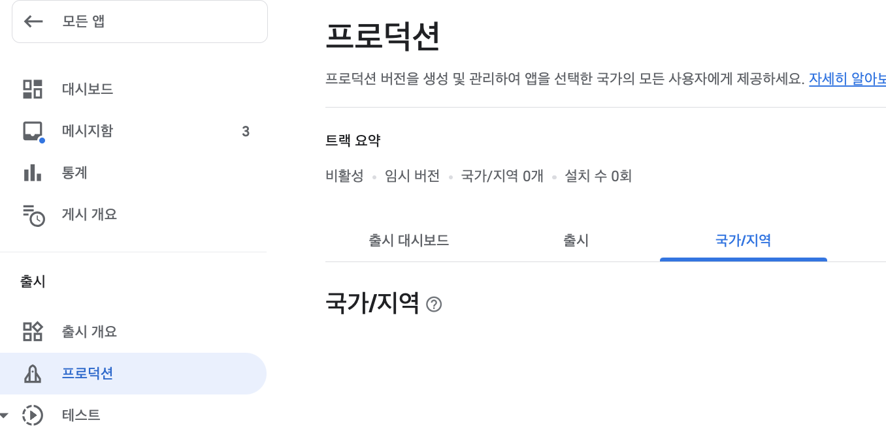
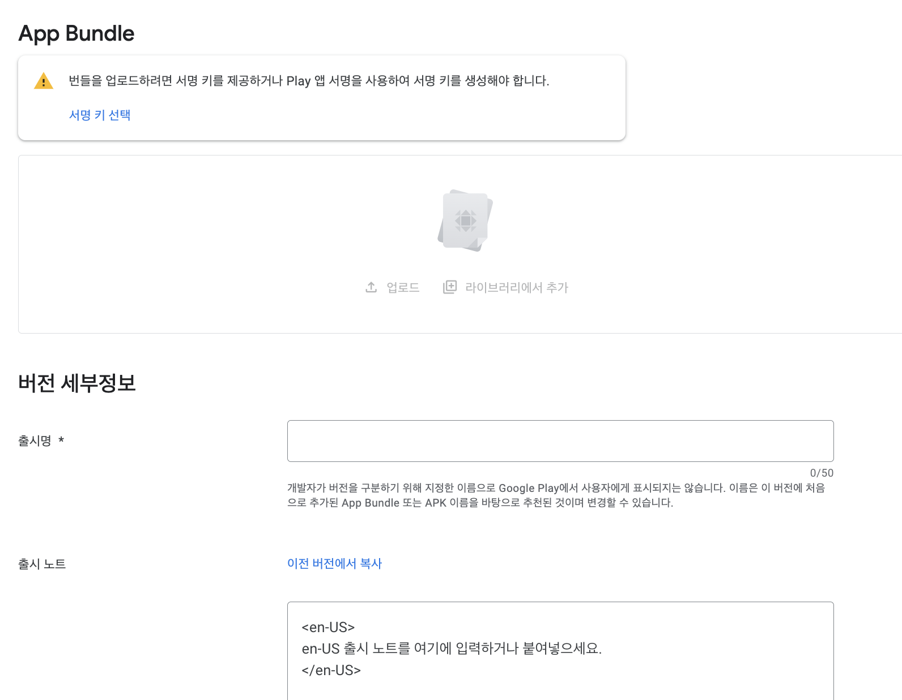

처음 사이드 프로젝트를 진행했을 때 모바일 웹 pwa를 만드는 것을 목표로 했었는데,
[Google Play에 프로그레시브 웹 앱 추가하기  |  Google for Developers](https://developers.google.com/codelabs/pwa-in-play?hl=ko#0) 해당 글을 읽고 PWA로 구글 플레이스토어에 쉽게 배포할 수 있음을 알게 되었고 플레이스토어 배포까지를 목표로 하게 되었다.

pwa를 스토어 출시하는 방법에는 다른 방법도 있지만, 여기서는 위 google문서를 참고하여 bubblewrap으로 앱 빌드하여 출시한 경험에 대해 소개한다.

참고로 앱 출시를 위해선 개발자 계정이 필요한데, 애플 개발자 계정은 연 $99(약 120,000원)를 지불해야하며 구글 개발자 계정은 최초 $25(약 30,000원)를 지불해야한다. 또한 앱 스토어 심사가 훨씬 까다롭고, pwa를 출시하는 것도 어렵다. 따라서 구글 플레이스토어에만 출시하기로 했다.

## 1. Bubblewrap을 통한 앱 번들 생성

```shell
npm install -g bubblewrap
```

```jsx
bubblewrap init --manifest=https://my-pwa.com/manifest.json
```

pwa 설정을 했으면 manifest.json 파일을 넣었을 것이다. manifest.json을 바탕으로 Android App Bundle을 구성한다.

](./1.png)
](./2.png)

서명 키가 아마 없을 것이므로 새로 만든다. 새로 만들면 업데이트 시 계속 써야하므로 키와 비밀번호는 어딘가에 잘 기록하도록 하자.

```jsx
bubblewrap build
```



생성된 .aab 파일을 플레이스토어에 업로드해야한다.

### 겪었던 이슈

- bubblewrap build 시 메모리 부족 에러
  ```jsx
  Error occurred during initialization of VM
  Could not reserve enough space for 1572864KB object heap
  ```
  - gradle.properties찾아서 1536m ⇒ 512m으로 수정해주었다.
- 버전 코드는 이미 사용되었습니다. ⇒ 버전 수정 후 다시 빌드해야한다.
  - 참고) [[Android] 버전 코드는 이미 사용되었습니다. 다른 버전 코드를 사용해 보세요 경고 대응](https://onlyfor-me-blog.tistory.com/773)

## 2. 구글 플레이 콘솔 출시

콘솔 출시 전에 미리 준비해야하는 게 있다.

1. 개발자 계정 (결제 필요)
2. 사업자 등록증 (없다면 웹 도메인 등록확인증. 나는 가비아에서 도메인을 샀으므로 가비아에서 확인증을 다운받아 제출했다.)
3. 개인정보 처리방침이 적힌 url
   1. [https://www.privacy.go.kr/front/main/main.do](https://www.privacy.go.kr/front/main/main.do) 여기서 만드는데 항목이 꽤 많다. 생성 후 복사해서 아무데나 올려놓으면 된다. (내 어플리케이션 사이트에 끼워놓아도 되고, https://sites.google.com 써도 되고, github.io 써도 되고 자유롭다. [https://soir1984.tistory.com/3](https://soir1984.tistory.com/3) 참고.)
4. 스토어에 보여질 앱 아이콘, 그래픽 이미지, 앱 내 스크린샷
   1. 아이콘: PNG 또는 JPEG, 최대 1MB, 512 x 512px
   2. 그래픽 이미지(출시 링크 공유시 보여질 썸네일): PNG 또는 JPEG, 최대 15MB, 1024px X 500px
   3. 앱 내 스크린샷: 2~8장 / PNG 또는 JPEG, 장당 최대 8MB, 가로세로 비율 16:9 또는 9:16, 가로세로 길이는 320px X 3840px 사이
   4. (선택 사항) 기타 필요하다면 동영상 url, 태블릿 스크린샷도 준비한다.

플레이 콘솔([https://play.google.com/console/developers/?pli=1](https://play.google.com/console/developers/?pli=1) )에서 새 앱을 만든다.

대시보드 - 앱 설정을 다 마치면 출시 검토를 받을 수 있다.



항목이 많아보이지만 해당되는 것만 체크하면 돼서 오래걸리진 않는다. 미리 준비한 개인정보 처리방침이나 스토어 등록정보를 기입한다.

사업자 등록증/도메인확인증의 경우 스토어 등록 정보 - 사전 알림 링크를 클릭하여 제출한다.





이 과정을 거치지 않으면 어차피 반려된다. 앱에 연동한 웹사이트가 내가 운영하는 웹사이트임을 고지해야한다.

다 기입하고, 프로덕션에 bubblewrap으로 만든 번들을 올려보도록 하자.

(프로덕션 말고 테스트용 버전도 생성 가능하다.)



- 국가/지역에서 출시 국가를 설정할 수 있다.



- .aab파일을 여기에 올린다. 출시명이랑 출시 노트는 중요하지 않아서 버전 잘 구분가게 써주면 된다.

프로덕션 트랙으로 출시 시작하면 되며, ‘검토 중’에서 출시됨으로 바뀐다. 반려 시 메일이 오므로 수정해서 다시 업로드하고 검토 요청을하면 된다.

### 디지털 에셋 링크 만들기

> Play에서 PWA를 테스트했다면 전체 화면이 실행되지 않는 것을 알 수 있습니다. 아직 [디지털 애셋 링크](https://developers.google.com/digital-asset-links?hl=ko) 파일을 통해 사이트의 소유권을 확인하지 않았기 때문입니다.

이 상태로 스토어에 출시하면 주소창이 보이며 웹 브라우저 티가 난다. 디지털 애셋 링크를 추가하여 연결을 마무리해야한다.

- SHA-256 디지털 지문을 Play Console에서 복사한 뒤, `bubblewrap fingerprint add <fingerprint>` 명령어로 assetlinks.json를 생성하는 방법이 있다. ([https://developers.google.com/codelabs/pwa-in-play?hl=ko#5](https://developers.google.com/codelabs/pwa-in-play?hl=ko#5))
- 나는 좀 더 쉬운 방법인 `Peter's Asset Link Tool`([https://play.google.com/store/apps/details?id=dev.conn.assetlinkstool&hl=ko](https://play.google.com/store/apps/details?id=dev.conn.assetlinkstool&hl=ko))을 사용했다. apk을 설치한 상태에서 (테스트 단계 앱도 ok) apk 검색 후 json을 복사해서 사용한다.

이 파일은 반드시 assetlinks.json 이름이어야 하며, my-pwa.origin/.well-known/assetlinks.json에 위치시켜야한다. (나는 Next.js를 사용했으므로 public폴더에 .well-known폴더를 만든 다음 넣어줬다.)

### 겪었던 이슈

- 혹시나 했지만 당연하게도 개인 소유 도메인을 구입해서 달아야 한다. 필자는 .xyz가 싸게 나와서 가비아에서 구입해서 달았다.
- 설명란에 앱이 가진 기능을 잘 설명해야 한다.
  의외로 검토하는데 며칠 안걸린다.(3일 정도?) 출시에 며칠 안걸렸던 것 같다. 메일로 반려 사유도 잘 설명되어있다.
- 검토중으로 넘어가지 않는 문제
  - ‘전송하여 검토받기’ 클릭하여 해결

## Reference

- [https://wp.swing2app.co.kr/knowledgebase/webview-playstore-apprelease/](https://wp.swing2app.co.kr/knowledgebase/webview-playstore-apprelease/)
- [https://soir1984.tistory.com/3](https://soir1984.tistory.com/3)
- [https://developers.google.com/codelabs/pwa-in-play?hl=ko#0](https://developers.google.com/codelabs/pwa-in-play?hl=ko#0)
- [https://tunapanini.tistory.com/entry/Bubblewrap-Trusted-Web-ActivityTWA-프로젝트를-통해-Progressive-Web-AppPWA을-APK-파일로-설치하기](https://tunapanini.tistory.com/entry/Bubblewrap-Trusted-Web-ActivityTWA-%ED%94%84%EB%A1%9C%EC%A0%9D%ED%8A%B8%EB%A5%BC-%ED%86%B5%ED%95%B4-Progressive-Web-AppPWA%EC%9D%84-APK-%ED%8C%8C%EC%9D%BC%EB%A1%9C-%EC%84%A4%EC%B9%98%ED%95%98%EA%B8%B0)
