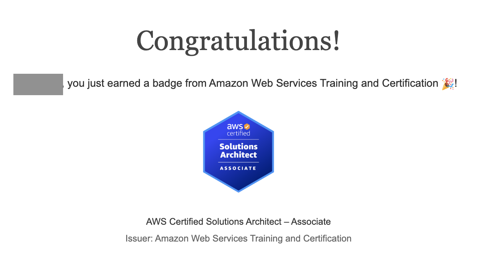
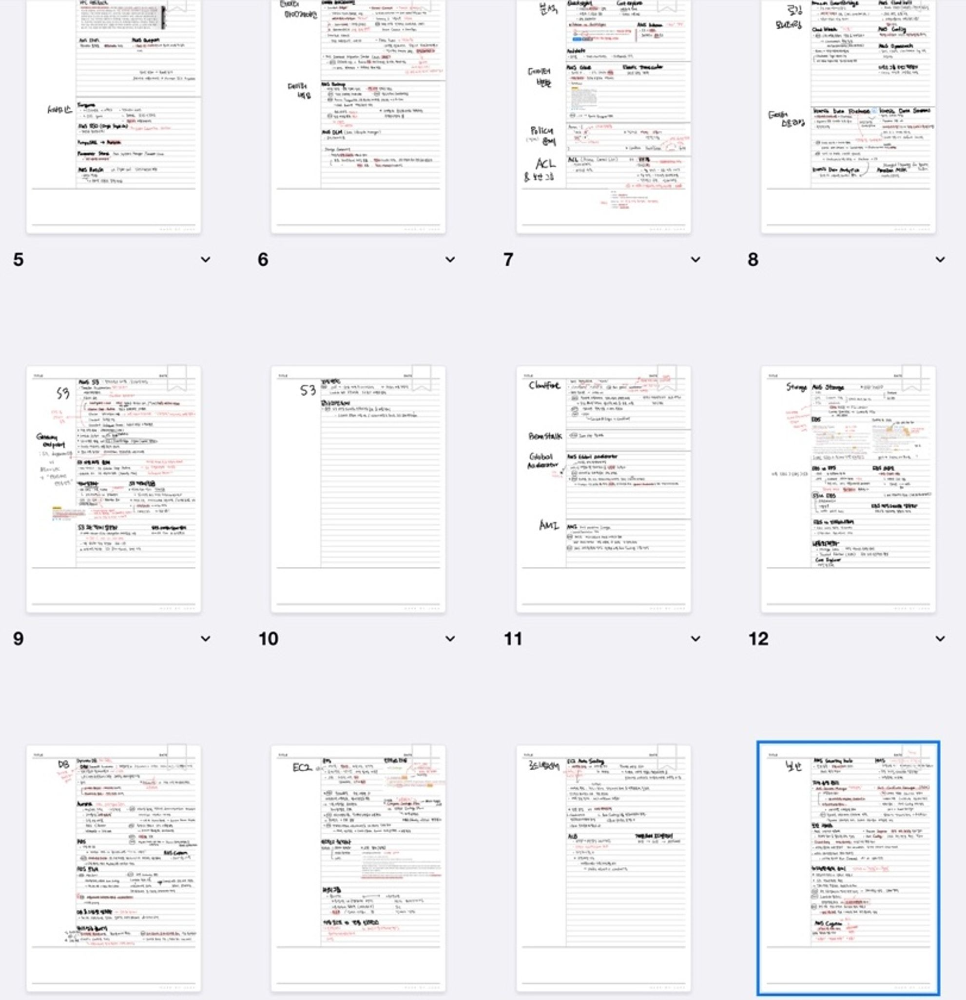

## SAA 준비 계기

올 초부터 주위에서 AWS 자격증 시험에 대한 이야기가 많이 들려왔다. AWS Practitioner를 준비하는 주위 개발자 분들도 생겼고, 떠돌아 다닌 기술블로그들에서 솔루션 아키텍트 자격증을 딴 후기가 심심찮게 보였다.

마침 AWS를 대체 어디서부터 공부해야할지 모르겠던 나에게 AWS 자격증은 솔깃한 이야기였다. (직접 해보면서 공부하는게 짱이지만, AWS를 연습하자니 뭐 하나 잘못해서 엄청난 요금이 과금될까봐 무섭고 뭐가 맞는지 모르는 채로 배포 경험만 늘어갔다..) 또, 나는 2020년부터 일년에 자격증 하나씩은 꼭 따자는 목표를 지켜오고 있었는데 올해는 AWS 자격증으로 하면 딱일 것 같았다. 문제 은행식 시험이라는 점도 회사다니면서 자투리 시간 활용하기 좋아보였다.

Practitioner와 Architect 중에 고민했는데 대부분 첫시험으로 아키를 고르는 것 같아서 나도 아키를 선택했다.

## 준비 과정

찾아봤을 때 시험 준비기간을 짧게는 한달 안, 3개월 정도로 잡는 것 같았다. 나도 처음엔 3개월로 잡았다 중간중간 다른 새로운 스터디, 할일이 생겨서 결과적으로 첫 시작부터 자격증 취득까지 5개월 걸렸다 ㅎㅎ.. 다시 시험을 본다면 단기간에 빡집중해서 볼 것 같다.

시험 후기들을 봤을 때 공부방법이 비슷해서 똑같이 나도 유데미 강의와 덤프문제를 공부했다.

- **강의:** https://www.udemy.com/course/aws-certified-solutions-architect-associate-saa-c03/?couponCode=SKILLS4SALEB
  - 할인할 때 사면 15000원밖에 안하니 저처럼 손해보지마시길..
- **덤프 900 문제:** https://www.examtopics.com/exams/amazon/aws-certified-solutions-architect-associate-saa-c03/view/41/

  - 정답이랑 최다득표가 다른 경우가 많은데, 정답으로 되어있는 것들은 틀릴 가능성이 많다. 최다득표가 더 정답에 가깝다.

  공부는 3월에 시작했다. 회사 사람들에게 스터디를 제안했는데 참여의사를 밝힌 사람이 생각보다(?) 많았다. 세달 동안 일주일에 한 번씩 회사에 남아서 한시간 스터디를 했다. 첫 한달은 같이 강의를 듣는 시간을 갖고 (강의 양이 좀 많음) 두달은 다같이 문제 풀이를 했다. 각자 시험을 보기로 하고 스터디를 끝냈다.

스터디를 끝내고 6-7월에는 개인적인 스터디와 팀풀을 하느라 AWS 준비를 잠깐 멈췄다.

8월엔 더 끌고가지말고 해치워야겠다는 생각이 들었다. 주말 두세시간씩 공부하다 시간이 비는 날에 신청했다. 시험전날에 우다다다 벼락치기를 했다.

강의도 양이 많고 덤프문제도 굉장히 양이 많다.

**둘다 끝까지 끝낸 내가 돌이켜보자면, 강의는 시험에 크게 도움은 안되는 것 같다.** 단기간에 합격하는게 목표라면 과감하게 강의는 버리고 (혹은 모르는 개념 나올때만 보고) 덤프문제만 풀 것 같다. 하지만 강의에 실습 영상도 있고 개념 설명도 잘 해주시기 때문에 **실무에서 도움이 되길 원한다면 강의를 추천한다.**

덤프문제도 양이 굉장히 많은데, 나는 끝까지 다 풀었지만 다시 시험을 본다면 **600번정도까지만 풀고 복습을 반복 할 것 같다**. 양이 많아서 어차피 뒷 부분까지 복습못할 가능성이 많고, 뒤로갈수록 코멘트도 적어져서 직접 정답을 찾아봐야하고, 내 경우엔 4-5백번대까지 왔을 때부터 키워드만 보고 보기를 추측할 수 있게 되었기 때문이다.

공부할 땐 키워드를 정리하면서 덤프문제 푸는 게 중요한 것 같다.

이렇게 DB / S3 / EC2 / ML / 보안 / 등등 카테고리를 나눠 놓고 정리했다.

처음엔 ‘여기선 최소 운영오버헤드 정답이 A인데 다른데선 B네? ㅡㅡ;;’ 하고 어이없어 했는데 계속 풀다보니 키워드 매칭이 가능하게 됐다.

- 풀다보면 예를들어 elastic cache는 ‘어플리케이션 코드 최소화’ 조건이 있으면 정답이 아니구나! 하고 감이왔다.
- 문제 키워드 보고 보기에 뭐 있는지 유추 가능하게 됐을 때 시험을 보면 될 것 같다.

### 다시 공부한다면..

- 앞서 말했듯이 덤프문제는 600 문제까지만 풀어도 괜찮을 것 같다. 강의는 내 생각엔 자격증만이 목적이라면 선택.
- 아무래도 문제은행식이라 단기간에 집중해서 따는게 좋을 것 같다. 좀 늘어졌더니 중복 문제를 봐도 중복 문젠지 모르고 또 풀고 같은 곳에서 틀리는 의미없는 짓을 하게 됐다..

## 접수

[AWS Certification 사이트](https://www.aws.training/certification/?ch=cta&cta=header&p=1)에서 가능하다.

- 시험 하루 전까지만 스케줄 변경 및 취소 가능한 걸로 기억한다. 스케줄 변경은 두번까지 가능했던 것 같다. 취소는 어떤 시점부터 수수료가 생겼던 걸로 기억한다.
- 접수비는 150달러이고, 약 20만원 들었다.
- 이게 단기간에 끝낼 수 있는 시험인데 접수비 때문에 (비싸서 한번에 붙어야한다는 부담감) 망설이게 돼서 접수를 쉽게 못하는게 문제인것 같다. 그러니 일단 눈감고 접수해버리고 과거의 자신을 원망하며 빡공부하는 걸 추천한다. 나도 모든건 미래의 나에게 맡기고 접수해버렸다가 아 이거 안될거같은데.. 했지만 이미 접수 취소 기한 지나서 울며 겨자먹기로 빡공부 할 수밖에 없었다.

## 시험 후기

### 시험장

- 온라인/오프라인 시험 선택 가능하다. 여러 후기들을 읽어본 결과, 온라인 시험을 선택하면 외국인 감독관과의 소통(?)이 힘들다고 후기를 많이 봐서 오프라인으로 봤다. 나도 오프라인을 추천한다.
- 준비물은 신분증 & 신용카드(or 여권 등) 두 개면 끝이다. 나는 불안해서 민증, 여권, 카드 다 들고갔다.
  - 신용카드에 영문 명이 접수명이랑 달라서(다르게 되어있는지 몰랐다.) 대신 여권을 내밀었다. 다 챙겨가길 잘했다고 생각했다. 접수할 때 작성한 영문명과 신분증 영문명이 일치하는지 잘 확인하시길..
- 적당히 소지품 검사하고 바로 컴퓨터 앞에 앉아서 시험을 보게 된다.
- 감독관 있고 정해진 시간에 스타트 하는 게 아니라 신청한 사람들 각자 알아서 시험보는 가벼운 분위기였다. 내가 갔을 땐 칸막이 쳐진 공간에서 두명이 먼저 시험을 보고 있었다.

### 시험

- 체감: 30%는 덤프 문제와 똑같이 나왔고, 30%는 키워드 알면 풀 수 있었고, 30% 정도는 처음보는 문제였던 것 같다.
- 시험시간은 140분. 나는 그냥 한시간 일찍 제출해버렸다 ㅎㅎ..
- 다풀면 검토할 수 있는 화면 생긴다. 65문제라 집중력이 금방 떨어지니, 일단 다 풀어버리고 검토하는걸 추천.

## 시험 결과

### 결과 통지 방법

- 2시 23분에 봤는데 당일 7시쯤 메일로 대뜸 합격했다고 뱃지부터 날라온다.
- 솔직히 접수비 20만원때문에 좀 긴장했다 ㅎㅎ; 또 시험 봐야 할까봐..

### 도움이 되었는가?

- 솔직히 실무에서는 못쓸 것 같다.
  - 만약 회사에서 RDS DB를 쓰고 있다 하면, SAA 시험에서 Aurora가 운영 오버헤드가 적고 여러모로 짱이라고 배웠으니 Aurora고 바꾸자고 할수도 없는 노릇이니…
- AWS 서비스를 전체적으로 훑을 수 있어서 좋았다. 시험 준비하기 전인 반년 전에 fargate, macie, aurora, global accelerator 들었으면 이것뭐에요 했을 것 같다..
- 준비하는 중간에 AWS Summit 컨퍼런스 갔었는데, 그때 이거 공부로 좀 알아들었다. 공부 안으면 별로 못 알아 듣고 벌벌 떨었을 듯.
- 묵힌과제 하나 끝낸 기분이라 기분이 좋다. 따길 잘한 듯!
