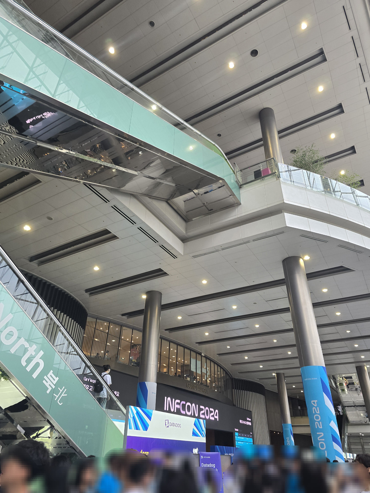
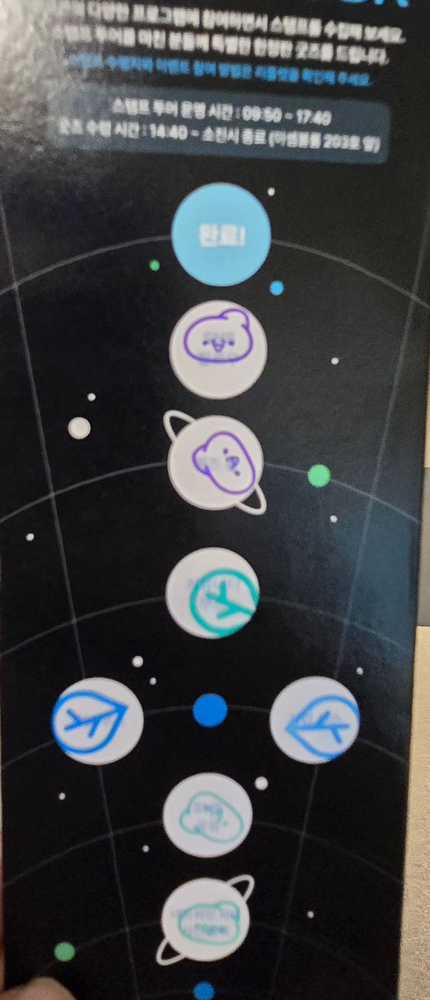
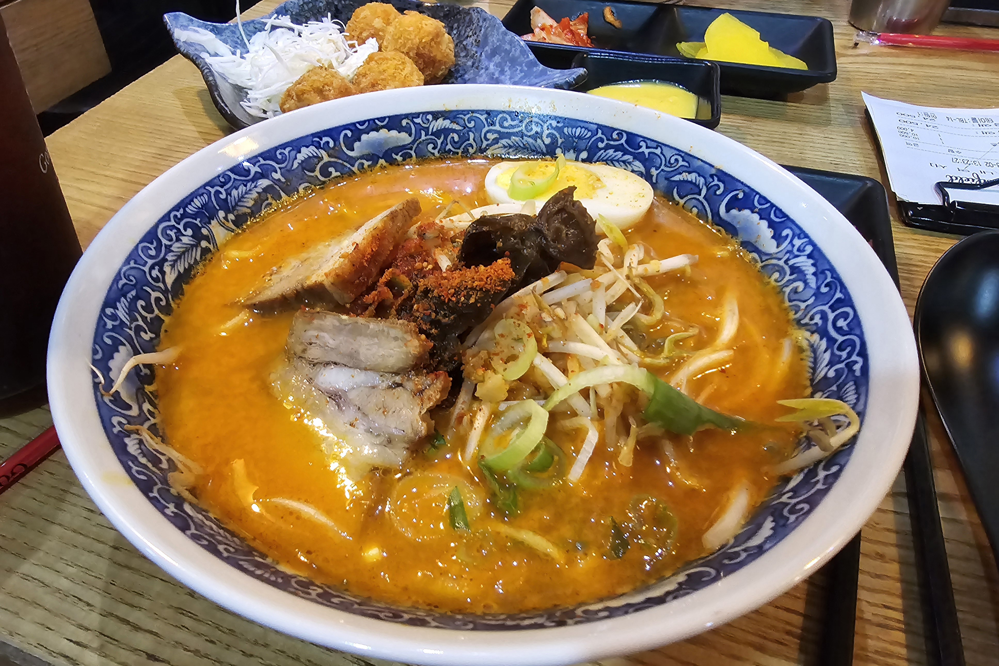
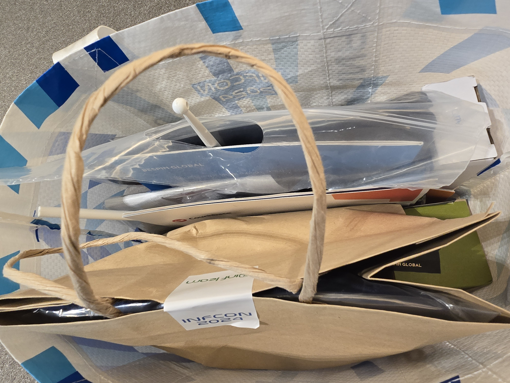

## 인프콘 2024

이맘 때 쯤이면 개발자 톡방이 컨퍼런스 티켓팅으로 술렁이는 것 같다. 인프콘은 컨퍼런스 중에서도 제일 인기많은 행사다. 내용이 다양해서 개발자가 아닌 사람들에게도 인기가 많다. 인기가 많아서 선결제 후 추첨 떨어지면 환불해주는 식으로 티켓을 판매한다.

내 주위에선 11명 정도가 신청했는데 그중 3명 정도 당첨된 것 같다. 그리고 그 중 한 명이 나다. 😆✌️ (작년에도 당첨됐었는데 이대로 내년에도 붙여주세요…!!)

작년 인프콘은 나에게 정말 큰 영향을 주었었다. 컨퍼런스 끝나고 연사님과 커피챗을 하기도 했고 세션에서 들었던 내용을 공부해보는 넥스트 액션으로 이어지기도 했다.

이번에도 같은 인사이트를 받을 수 있을까 기대를 안고 갔다. (모두의 부러움을 한 몸에 받으며…)

참고로 커피는 회장 내부로는 반입 불가능하지만, 밖에 커피 둘 곳을 마련해주셔서 세션 사이사이에 마셨다. 충전하기도 쉽지 않으니 노트북 풀충으로 오길 바란다. 와이파이는 코엑스 무료 와이파이를 쓸 수 있다.

## 들은 세션들

세션은 총 6개를 들었고 세션 듣기도 바빠서 네트워킹 파티는 참석하지 못했다.

평소 관심있는 기술과 성장 키워드가 들어간 세션들을 들었다.

1. **컴퓨터 밑바닥에서 찾는 개발자 성장의 비밀**
   1. 교수님이 설명해주시는 컴퓨터 구조… 컴퓨터 밑바닥=(CPU, OS)를 뜻한 것이었다. 재밌었다. 전공으로 들었던 것들 다 까먹었는데 대학시절 컴퓨터 구조 과목 듣던 때로 돌아간 기분도 들었다…
   2. 세션을 ‘ARM 칩 기반 맥북은 어떻게 소모전력이 낮음에도 성능이 높을까?’ ‘안드앱 소스코드엔 main() 메소드가 왜 없을까?’ 등의 질문으로 시작헸는데, 이 세션을 다 들으면 정답을 알 수 있다. 궁금하면 직접 듣도록 하자.
   3. 마지막에 책 두권을 추천해주셨다. 그 중 **‘컴퓨터 밑바닥의 비밀’**은 한 번 읽어보려고 생각 중이다.
2. **Next.js 블로그 모범 사례 탐구: Vercel 리더십 블로그 아키텍처 파헤치기**
   1. 이것도 꽤 재밌는 세션. 일반적인 넥스트 블로그는 어떤식으로 만드는지, 또 vercel의 리더십 두분이 블로그를 어떻게 다르게 만들었는지 비교하고, 마지막으로 연사님은 블로그를 어떻게 만들었는지를 설명한 세션이다.
   2. vercel의 리더십 두분이 잘 만든 넥스트 예제를 만들자고 서로 짠 것처럼 다른 방식으로 블로그를 만들었다는 사실이 재밌었다. (진실은 아무도 모르지만)
   3. 나도 연사님처럼 gatsby로 블로그를 만들었는데 이거 듣고 next로 갈아타고 싶은 마음이 들었다 ㅎㅎ.. (나중에 욕심생기면 db 붙이기도 좋을 것 같고, 갯츠비로 만들고 나서 그냥 익숙한 넥스트 할 걸 그랬나 후회하는 마음이 초큼 있었다.. next 블로그 영업이 됐다ㅎ)
   4. 내가 블로그를 만든다면 나도 db없이(블로그는 프론트만 관리하고 싶다.), 또 글을 코드로 관리하는 Rouchg 방식으로 만들 것 같다.
3. **멀티패러다임 프로그래밍 언어의 시대: 객체지향과 함수형을 섞어야할 때!**
   1. 이것도 재밌는 세션.. 라이브 코딩으로 tagged templates를 만들면서 함수형과 객체지향을 어떻게 적용해야할지 보여주신 세션이다.
   2. 역시 라이브 코딩은 어렵구나 생각을. ㅎㅎ
   3. 함수형은 정말 가독성이 좋구나 새삼 감탄.
   4. 함수형과 객체지향을 어느 때 써야할지 헷갈렸는데 ‘**구조의 문제는 객체지향으로, 로직의 문제는 함수형’** 이라고 명쾌한 마무리를 지어주셔서 좋은 힌트를 얻어간 것 같다. 저자이신 ‘멀티 패러다임 프로그래밍’이라는 책을 홍보 하셨는데 읽어보고 싶다.
4. **난생처음 만드는 Vite 플러그인**
   1. 비트 플러그인을 비트가 어떻게 읽고 어떤식으로 만들면 되는지 설명한 세션이다.
   2. 라이브 코딩 대신 녹화해오시다니 현명하시다고 생각함.
   3. 모든 걸 공부할 수 없으니 재밌는걸 공부하자라는 마무리에 공감했다.
5. **그래픽 엔진 포팅 사례로 배우는 웹어셈블리 웹 컴포넌트 개발부터 디버깅, 최적화까지**
   1. ThorVG의 WASM 웹 포팅 사례를 공유해주신 세션이다. 웹 포팅하면서 쓴 툴이나 장단점을 설명해주셔서 좋았다.
   2. 와 이거 정말 신기하고 안쓸 이유가 없겠는데… 하면서 봤다. 이제 C++도 파야하나 생각하다가 이렇게 생각하면 끝도 없겠다 싶어서 생각을 말았음.
   3. 기술들이 점점 어렵게 발전하는 것 같다 하하 (갈수록 쉬워져야하는거 아니냐고~~) GC없이 메모리 릭을 신경써야하는 부분만 봐도 (생각해보면 당연함) 개발자의 부담감이 더 늘어나는듯.
6. **개발자로 긴 커리어를 가지고 싶다면?**
   1. 마지막으로 들었던 성장에 대한 좋은 이야기를 나눠주신 세션이다.
   2. 나이는 정말 중요하지 않다, 생각보다 시간이 정말 많다… 를 강조하셨다.
   3. 제일 기억에 남는 건 롱 텀은 잘할 거라 믿고, 숏 텀은 열심히 살아야한다는 것이다. 롱 텀 기간을 짧게 잡으면 당연히 성과가 날 수 없음에도 발전이 없다고 좌절하게 된다는 것이 공감이 갔다.

개인적으로 들었던 것 중에서는 Vercel 블로그 세션이 제일 좋았다. 제일 나의 다음 액션에 영향을 미칠 것 같은 세션이었기 때문이다. 블로그를 next로 바꾸는 거에 뽐뿌 온 듯.

다른 세션들도 너무 좋았다. 인프콘은 세션을 무료로 공개하기 때문에 꼭 들어보기를 추천한다.

## 스탬프 투어

세션 사이사이 남는 시간에는 스탬프 투어를 다녔는데 역시 랜덤 뽑기를 하니까 도파민이 돌고 눈이 번쩍 떠지고 재밌었다.

기업 부스 스탬프를 위해 데이터독 부스를 들렸는데, 유튜브 데이터독 RUM 웨비나에서 봤던 분이 계셔서 신기했다.

데이터독 부스에서는 대면으로 데이터독 강의를 들을 수 있었다. 보통 부스들은 구글폼 제출하고 룰렛돌려서 회전율이 빠른데, 데이터독은 짧은 제품 데모를 준비해오셨다. 내용이 유익해서 호감이었다. 티셔츠 질도 좋았다.

티셔츠를 한가득 받아와서 월화수목금 돌려입고 있다 ㅎㅎ

## 마치며

### 작년과의 비교

작년엔 핸즈온 세션이 있었는데 올해엔 핸즈온 대신 ‘프로그램’이란 게 생겨있었다. (일반 세션과의 차이점은 모르겠다. 들었을 땐 차이 없었다.)

핸즈온이 없어져서 아쉬웠다. 다같이 우당탕탕영차영차하는 맛이 있는데…! 그리고 작년 웹접근성에 대한 핸즈온 세션에서 많은 걸 배워갔던 게 기억에 남기 때문에, 이번엔 핸즈온이 없는 게 좀 아쉬웠다.

작년엔 20분짜리 세션들이 많아서 인사이트를 얻기엔 너무 짧았었는데, 이번엔 40분 세션이 많아서 좋았다. 40분이 딱 깊게는 못 배우더라도 새로운 것을 얻어가기 적당한 시간인 것 같다.

작년에 정말 얻어간게 많아서 비교하자면 작년이 더 좋긴 했지만, 올해 인프콘을 통해서도 새로 공부하고 싶은 분야들을 이것저것 찾게 되었으니 만족스러웠다.

(제발 내년에도 저를 붙여주세요)

### 느낀 점

매일 하는 개발에 번아웃이 오려고 할 때 컨퍼런스에 가면 힘을 얻는 것 같다. 개인적으로는 컨퍼런스들 중에서도 정말 새로운 인사이트를 얻게 해주는 세션들이 많은 인프콘을 제일 좋아한다.

세션들을 들으면서, 공통적으로 연사님들이 하셨던 이야기는 커뮤니케이션의 중요성이었다. 오래 개발자를 하려면 협업 & 커뮤니케이션 능력과 내가 아는 것을 설명할 수 있는 능력이 중요한 것 같다.

그래서 이번 인프콘을 계기로 나의 새로운 다음 액션을 정해보았다.

1. 내가 안다고 생각하는 것들을 설명할 수 있을 정도로 파보기.
2. 블로그 넥스트로 바꾸기 (아마도)
3. 컴퓨터 밑바닥의 비밀 / 멀티 패러다임 프로그래밍 책 읽기

몇 개나 해낼지는 모르겠지만, 세션에서 들었던 것처럼 롱텀은 잘할 수 있을 거라 믿고 숏텀은 오늘의 일을 해야겠다!
