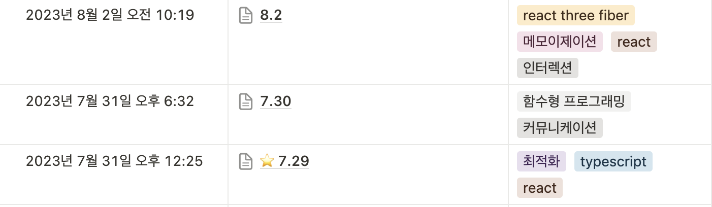
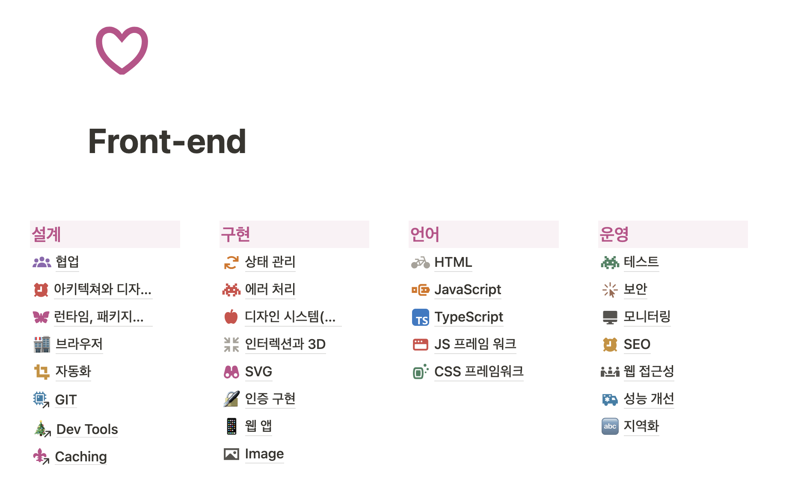

2023년은 프론트 개발자로서 1-2년차를 보낸 해였다.

회사에서 맡고 있던 프로덕트가 바뀌기도 했고, 스스로도 이런저런 시도를 했기 때문에 의미있는 해였던 것 같다.

## 기술적 성장

### 디자인 패턴에 관심을 갖게 되다

이전의 나는 개발은 학교 과제를 낸다든지, 동아리 과제를 한다든지 하는 챌린지식의 급한 개발을 해왔기 때문에, ‘주어진 과제를 구현 해내는 것’을 제일 중요하게 생각해왔던 것 같다.

올해 초에 회사 내 팀이 바뀌면서 내가 직접 프로덕트를 구축해야하는 일이 있었는데, 하면서 그동안 생각하지 못했던 것들이 눈에 들어왔다.

1. 새 프로젝트를 생성할 땐 항상 이런식으로 디렉터리 구조를 만들어왔었는데, 프로젝트가 커지니 불편했던 것 같아. 다른 구조를 쓰는게 좋을까?
2. React를 쓸 때보다 Next.js를 쓰니 구조를 잡는게 더 편해졌는데, 서버가 생기니까 나눠서 개발하는게 어렵네
3. 요구사항이 갑자기 생기니까 코드가 복잡해지고 가독성이 안좋네. 더 좋은 방법이 있을까?

그러면서 비로소 아키텍쳐와 디자인 패턴의 중요성을 느끼게 됐다.

하지만 자바 클래스로 된 각종 아티클을 읽으면서 이걸 리액트에 어떻게 적용할 수 있는거지?’ 라는 고민이 항상 있었다. (회사에 프론트엔드 개발자가 나와 연차가 비슷하거나 더 미만인 소수의 사람들로만 구성되어있다는 것도 답을 찾는 어려움에 한 몫 했다.)

여기엔 [테오님의 아티클](https://velog.io/@teo/Javascript에서도-SOLID-원칙이-통할까#1개의-함수는-1개의-역할만-수행하자)이 도움이 되었다.

그 외 운좋게 시니어 개발자 분과 커피챗할 기회가 있었는데 같은 질문을 여쭈어 보았더니, 어렵게 생각하지 말고 리액트는 UI를 그리기 위한 수단일 뿐이라 생각하라고 답을 주셨다.

다음에 갔던 컨퍼런스에서도 디자인 패턴 세션을 들으면서 생각 정리가 되어갔던 것 같다.

결국 프론트는 함수형 프로그래밍만 써야해! 이런건 정해져 있지 않고 디자인 패턴이라는 건 ‘패턴’일 뿐, 그 아이디어를 어떻게 녹여내는가에 달려있는 것 같다.

요즘은 나도 내 개발 속에 패턴을 녹여보려는 시도를 하고 있다. (무엇보다도 패턴이라는 것은 더 편한 코드 작성 도움을 주는 프로그래밍 역사 속에서 경험적으로 축적된 기본서일 뿐, 정답은 없다는 것을 깨달았으니.)

### 디자인 시스템을 만들어보다

회사의 새 팀으로 가면서 새로운 프로덕트에 맞는 디자인 시스템을 만들게 되었다.

디자인 시스템을 만들면서 어떻게 CSS 변수를 만들고 선언적인 컴포넌트를 만들지, 어떻게 props를 짤 지 고민해보기도 했다.

만들면서 생각한 것은, 디자인 시스템이란 기획자, 디자이너, 개발자 삼박자가 맞아떨어져야 만드는 의미가 있다는 것이다. 셋 중 하나가 변화를 마구 만들어내면 나머지도 같이 틀어지게 되어있다.

다행히 좋은 디자이너를 만났고, 좋은 디자이너는 변수 명이나 variant명도 이름을 잘 지어줘서 개발하는 데 도움이 많이 되었다. (네이밍 스트레스를 받지 않아도 된다!)

### 그 외

- 이전에는 Github Desktop이라는 git GUI 툴을 쓰고 있었는데, 완전히 손에서 떼게 됐다 **🥳🎉**
  - 왜 남들은 이 프로그램을 안쓸까? 나도 안써봐야겠다 하는 생각에서 손에서 떼게 된 건데, 완전히 터미널을 이용하게 되면서 왜 안쓰는지 비로소 알게 됐다. 터미널만 쓰는게 더 빠르다 ㅋ
  - git 명령어에 친숙하지 않을 땐 Desktop을 써도 좋을 것 같다. git 명령어에 더 익숙해졌다는 것 같아 좋고, 더 배워야겠다는 생각(git도 계속 발전하고 있다는 것을 명심할 것)
- 이슈 탭과 가까워졌다. 이전에는 영어로 이슈탭에 글을 쓰는 것이 껄끄러웠는데 (영어 울렁증 우웩.) 라이브러리 이슈 문의할 일이 생기면서 몇 번 글을 남겼고, 생각보다 별 거 아니라는 인상을 받았다. (잘못 올렸으면 이슈를 닫으면 되고~ 누가 감시해서 회초리질 하는게 아니라고 생각하면 마음이 편하다.)
- AWS 배포를 하다.
  - amplify로 배포했다 이슈(amplify 내 모노레포 관련 이슈라 배포 방식을 바꿨다. 이런 이슈가 생길 수도 있구나 깨달았던…)를 겪기도 하고, pm2로 배포해보기도 하고, 빈스톡으로 배포해보기도 했다.
  - 직접 배포해보면서 여러 글을 서치 했던 게 도움이 됐다.
- 사이드 프로젝트를 하면서 궁금했던 tailwind도 써보고, (쓰면서 느낀점은 확실히 편하지만 다른 styled 라이브러리랑 같이 써야 더 보완될 것 같은데, 어떻게 역할을 나눠서 같이 쓸지?가 고민이 됐다. 요즘은 그래서 tw.macro + emotion과 그냥 vanilla extract를 쓰는 것에 관심이 감.) 지라 협업 방식도 경험해보고, next.js app router도 경험해 보았다. (생각보다 클라이언트 컴포넌트가 많이 생겨서, 컴포넌트를 어떻게 나야눠야 서버 컴포넌트의 장점을 가져갈 수 있을지에 대한 고민이 있었다.)

## 개인적 성장

### 사수 없이 성장하기

- 사수없이 성장하기 시리즈 글은 기술 블로그들에 많이 있지만.… 나는 이렇게 했다.
  - AI 활용하기
    - 물론 AI를 쓰다보면 AI가 생각보다 헛소리를 많이 한다는 것을 알게 된다.
    - 하지만 유틸 함수나 익히 잘 알려진 컴포넌트를 구현할 때 작업시간을 줄여주기도 했고, 코드 분석이나 외국 아티클 번역 같은 시간이 걸리는 일에도 도움이 됐다.
  - 컨퍼런스 다니기 (FE Conf, 인프콘 등)
    - 운좋게 FE Conf 티켓팅도 성공하고 인프콘 추첨도 당첨돼서 둘 다 다녀왔다.
    - 갔다오면 요즘 다른 개발자들은 개발할 때 이런걸 고민하고 있구나~ 생각하게 되고 내 프로젝트에 적용할만한 새로운 인사이트도 얻을 수 있어서 좋았다.
  - 구독을 많이했다 (medium, FE article, naver fe news 등)
    - medium 연 결제를 끊어버렸는데 매주 재밌는 아티클들이 메일로 들어와서 좋다. (시간 날 때 한 번 씩 읽고 있다.)

### 노션을 더 적극적으로 활용하다

1. Today I learned

   하루하루 배운 내용을 기록하는 TIL은 이전에도 작성했었다.

   블로그에 정리하기도 했고 깃헙 레포를 파보기도 했다. 이러저러한 방법을 시도하면서 느낀 점은 TIL은 하루에 한 번씩을 생각하면서 만든 건데, 각잡고 글을 써야하다보니 시간 상 잘 안적게 되면서 그날그날 배운 정보를 손실하고 마는 것이었다.

   그래서 생각한 것이 각잡고 글을 쓰는게 아니라 그날 새로 알게된 정보를 가볍게 링크와 함께 첨부만 하는 것이다.

   물론 이렇게 했을 때 직접 정리하는 게 아니기 때문에 기억에 덜 남고, 필요할 때 바로 떠올리지 못할 수 있다는 단점이 있다. 그래서 정리하다가 더 잘 기억하고 싶은 정보는 따로 [정리한 개발 문서](https://www.notion.so/2023-cbc5c09fd24c42ffbda5b971cacabee2?pvs=21)에 추가했다

   

   이렇게 하다보니 글 작성에 대한 부담감이 덜어져서, 작년 6월부터 시작해서 TIL을 꾸준히 정리해올 수 있었다.

2. 나만의 개발 문서 창고 만들기

   손실되는 정보를 줄이기 위해 나만의 창고를 만들었다. 그때그때 관련 지식이 기억이 안나면 들어가서 찾아볼 수 있게 정리했다.

   

   이렇게 정리해두면 관련 지식이 필요해질 때 ‘아 그거 뭐였더라’ 싶다가도 여기에 정리해뒀다는 사실은 기억할 수 있다.

## 2024년에는?

- 오픈소스 기여를 해보고 싶다.
  - 그 전에는 번역이나 간단히 기여할 수 있는 건 해봤는데 코드 상의 이슈를 해결해보고 싶다. (good first issue 주의깊게 보는 중.)
- T자형 인재가 되기 위해 다른 도메인이나 다른 프로그래밍 언어도 해보고 싶다 (백이나 앱 쪽)
- 더 많은 git 명령어 자유자재로 다루기
- 더 많은 개발자들과 교류하기! 내 주위엔 개발자가 너무 적다 😞
