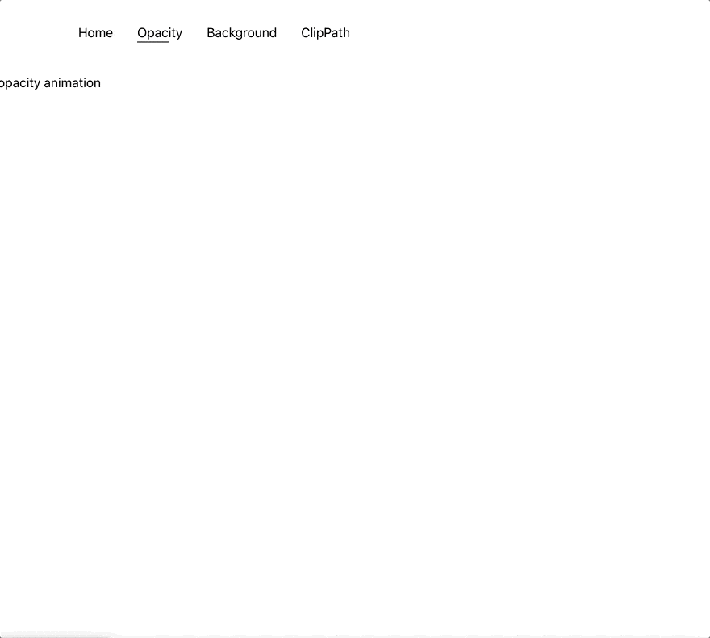
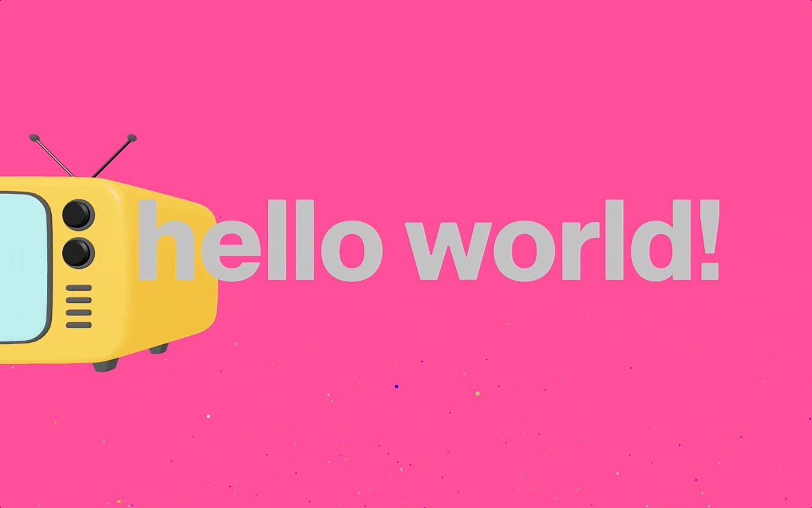
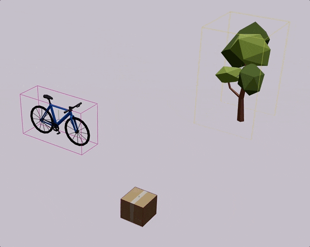
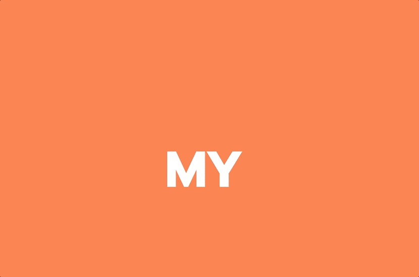
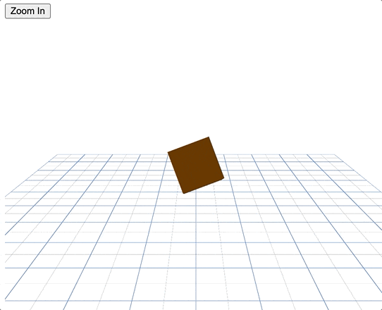

## 개요

지난 6월부터 7월까지 두달 간 **잇츠 스터디크루 2기**로 진행된 **‘애니메이션으로 화려한 웹 만들기’** 스터디에 참여했었다.

평소 **크리에이티브 디벨로퍼** 분야와 **인터랙션 개발**에 관심이 많았지만, 회사에서 직접 구현할 기회는 거의 없었다. 특히 랜딩 페이지나 이벤트 페이지와 같은 경우가 아니면 과도한 애니메이션은 오히려 사용자 경험에 부정적일 수 있다는 점을 최근에 느끼면서 욕심을 덜어내기도 했다.

인터렉션에 대한 관심은 강의를 틈틈이 듣거나 간단히 실습해보는 정도에 그치고 있었다.

그러던 중 잇츠 스터디 크루 스터디 목록에서 너무나 하고 싶었던 이 주제가 눈에 띄어 바로 신청했고 다행히 스터디원으로 선정될 수 있었다.

스터디를 통해 배운 점과 결과물들을 남기고자 한다. 스터디는 초반에는 **2D 애니메이션**을, 후반에는 **3D 애니메이션**을 중심으로 진행되었다.

### 1주차: framer-motion을 사용한 **스크롤 애니메이션**

1주차는 디자인 에이전시 사이트의 스크롤 인터랙션을 참고해 framer-motion을 활용하여 **_클릭 시 트리거 되는 애니메이션과 스크롤에 따라 트리거되는 애니메이션_**을 구현했다.

이전에 `interseptor observer`와 `css keyframes` 의 조합으로 스크롤 애니메이션을 구현해본 적은 있었지만, `framer-motion`으로 처음 구현해보니 더 간단히 구현할 수 있었다. 또한 스크롤의 진행 정도와 애니메이션 진행정도를 매핑하거나 순차적 애니메이션을 줄 때 `framer-motion`을 사용하면 쉽게 구현할 수 있다는 것을 알게 되었다.

- **구현 및 학습 내용**
  1. **기본 트랜지션 작성**
     - `motion` 엘리먼트를 이용한 간단한 트랜지션 작성 방법을 익혔다.
  2. **스크롤 기반 애니메이션**
     - `useScroll` 훅으로 스크롤 위치를 가져와 애니메이션 트리거로 사용했다.
     - `useTransform` + `useScroll` 조합으로 특정 스크롤 위치 범위를 특정 범위 값으로 변환해 애니메이션에 활용할 수 있었다.
  3. **이벤트 기반 상태 변화**
     - `useMotionValueEvent`: 스크롤 이벤트와 같이 특정 이벤트 트리거 시 값을 감지하여 상태 변화를 일으키는 방식으로 활용했다.
  4. **자식 요소 간의 시간차 애니메이션**
     - 순차적으로 발동하는 애니메이션 구현 시 `staggerChildren`을 사용하면 쉽게 구현할 수 있었다.

### 2주차: framer-motion **라우트 전환 애니메이션**

2주차엔 똑같이 framer-motion을 사용하여 여러 레퍼런스들을 참고하여 **_라우트 전환 애니메이션_**을 구현하였다.

- **구현 및 학습 내용**
  1. `AnimationPresense`을 사용해 컴포넌트 언마운트/마운트 시 애니메이션을 제어했다.
  2. **라우트 전환 커튼 애니메이션**
     1. 현재 라우트가 언마운트 될 때와 다음 라우트가 마운트 될 때 각각 애니메이션이 트리거 되도록 설정했다.
  3. **Clip-Path 애니메이션**
     1. 독특한 애니메이션을 써보고 싶어서 서치하다가 `clip-path`를 사용한 애니메이션을 보고 라우트 애니메이션에 적용해보았다.
     2. clip-path generator를 검색하면 원하는 도형의 clip-path 코드를 쉽게 딸 수 있었었다.

### 3주차: R3F를 사용한 스크롤 애니메이션

3주차부터는 3D 애니메이션을 다루기 시작했다. 3주차에는 **_R3F를 사용해 스크롤 애니메이션_**을 구현했다.

3d를 하면서부터는 에셋이 필요했기 때문에 무료 에셋 사이트들을 찾게 됐는데(나중에 여유가 있다면 모델링까지 직접 만들고 싶다.),
[**sketchfab**](https://sketchfab.com/)와 [**poly.pizza**](https://poly.pizza/)를 알게 되었다.

스케치팹은 유료가 대부분이지만 필터링 설정으로 무료 에셋을 찾을 수 있다. (몇 없긴 하다..)

요즘은 유튜브에 인터렉션 관련 영상과 오픈소스가 많아져서 참고할 수 있는 코드가 많아 좋은 것 같다. 유튜브에서 여러 코드를 참고하며 구현했다.

- **구현 및 학습 내용**
  1. **마우스 애니메이션**
     1. `useFrame`사용해 매 프레임마다 마우스 포인터 위치를 가져와 오브젝트를 회전시켰다.
     2. 마우스 위치에 따라 카메라 위치를 바꿔서 꿀렁거리는 느낌을 주고 싶었는데, three 라이브러리`MathUtils.lerp` \*\*\*\*함수를 사용했다. 이때 처음 알았는데 선형보간법이 3d에서 자연스러운 움직임을 구현하는데 많이 쓰이는 것 같았다.
  2. **텍스트 애니메이션**
     1. `drei`에서 제공해주는 3d 텍스트 컴포넌트를 사용했다.
     2. `framer-motion-3d`를 사용해 `motion.group`으로 텍스트를 감싸고, 스크롤 이벤트를 트리거로 설정해 구현했다.
  3. **스크롤 애니메이션**
     1. 스크롤 애니메이션은 gsap의 ScrollTrigger Timeline으로 구현하면 더 쉽겠지만, 패키지를 더 설치하고 싶지 않아서 `useFrame`으로 현재 섹션 번호를 계산해 모델의 위치를 동적으로 변경하는 방식으로 구현했다.

### 4주차: R3F를 사용한 키보드 애니메이션

4주차엔 **_키보드 입력과 물리 기반 애니메이션_**을 구현했다.

이때부터 스터디 리더 분이 공유해주신 유데미 R3F 강의를 들었다. 좋은 강의를 공유해주셔서 너무 감사했다. 스터디를 진행하면서 완강했는데 많은 도움이 됐다.

- **구현 및 학습 내용**
  1. **키보드 입력 처리**
     - R3F의 \**`KeyboardControls`*를 사용해 키보드 입력과 오브젝트의 움직임을 매핑했다.
  2. **물리 법칙 적용**
     - `Physics`로 물리 법칙을 적용할 수 있었다. 물리법칙을 구현을 위해 `@react-three/rapier` 를 사용했다.
     - 나무는 fixed로 바닥에 고정시키고, box는 오브젝트에 의해 충격을 받을 수 있게 했다.
  3. 충돌 영역 설정
     1. 이번에는 사용하지 않았지만, `colliders="hull"`라는 충돌 영역을 메쉬 모양에 맞추는 옵션이 있었다. 해당 옵션을 넣고 바퀴 따로 몸체 따로 힘을 다르게 잘 주면 아마 진짜 자전거같은 움직임을 만들 수 있을 것 같다.
  4. **이슈:** 자전거가 일정 시간 후 움직이지 않는 이슈가 있었는데 알고보니 RigidBody는 일정 시간이 지나면 잠드는 것(sleep) 같았다. Rigidbody의 canSleep과 applyImpulse의 두번째 인자를 false로 넣어주면 계속 활성상태로 유지할 수가 있어서 해당 방법으로 해결했다.

### 5주차: 토스페이스 클론코딩

5주차는 [토스페이스 클론 코딩하는 아티클](https://velog.io/@blcklamb/토스페이스를-클론코딩-해보자)을 클론코딩 해보는 시간을 가졌다. 로 시작되었다 (좋은 아티클 감사합니다)

- **구현 및 학습 내용**
  - 2d-3d 뷰 전환 기능을 추가 구현했다.
    - 모델들을 같은 z축에 정렬시키고 카메라의 위치를 마주보게 하면 되지 않을까 싶어서 그렇게 구현했는데, 카메라도 2d 뷰로 전환시킬 방법을 찾아야 할 것 같다. 나중의 과제로 남았다.

### 6, 7주차: 포트폴리오 사이트 만들기

마지막으로 각자 학습한 애니메이션을 응용하여 프토폴리오 사이트를 만들어보는 과제를 진행했다.

(내 포트폴리오는 좋은 디자인 아이디어가 떠오르지 않아 미완성 상태로 남았다. 3d도 포기 못했고 좋아하는 네오 브루탈리즘 스타일 2D 디자인도 포기할 수 없었는데 둘을 잘 결합시킨 형태가 떠오르지 않았다 …)

- **구현 및 학습 내용**
  1. **마우스 커서 커스터마이징**
     1. 마우스 커서를 숨기고, 마우스 포인터 움직임에 따라 원을 띄워서 구현했다.
  2. **clip-path 애니메이션**
     1. 화면 진입 시 2주차 스터디 때 구현했던 clip-path 애니메이션이 트리거되도록 했다.
  3. **가로 스크롤 풀 페이지 화면**
     1. gsap을 사용했다.
  4. **3D와 함께 움직이는 2D svg 요소**
     1. `BBAnchor` 컴포넌트로 네오 브루탈리즘에 자주 보이는 도형 svg를 넣어보았다.
  5. **이슈:** Next.js의 App Router를 사용할 때 라우트 전환 애니메이션 구현에 문제가 있었다. 관련 [Discussion](https://github.com/vercel/next.js/discussions/42658)을 확인했지만 아직 시도해보진 못했다. 추후 과제로 남겨두었다.

## 회고 및 느낀 점

- 같은 관심사를 가진 사람들끼리 모여서 서로 레퍼런스와 공부한 내용들을 공유하거나 잘 안되는 건 도우면서 개발하니까 재밌었다.
- 다른 우선순위에 밀려 못하던 일을 단기간에 집중하여 공부할 수 있어서 좋았다. 스터디의 장점을 느낄 수 있었던 스터디였다.
- 크리에이티브 코딩, 인터렉션 개발 분야가 너무 매력적인 분야라고 느껴졌다
- **그 후에 해본 것**

  - 

- 옛날에 재밌게 봤던 라온마라는 드라마에서 인상깊게 봤었던 연출 기법인 ‘버티고’를 구현해보고 싶었다. 카메라를 뒤로 빼면서 줌인을 당겼다.
- **앞으로는?**
  - 만화/영상의 연출 기법에 관심이 있는데 하나하나 웹에 구현해보면 재밌을 것 같다. 시간나면 해보고 싶다.
