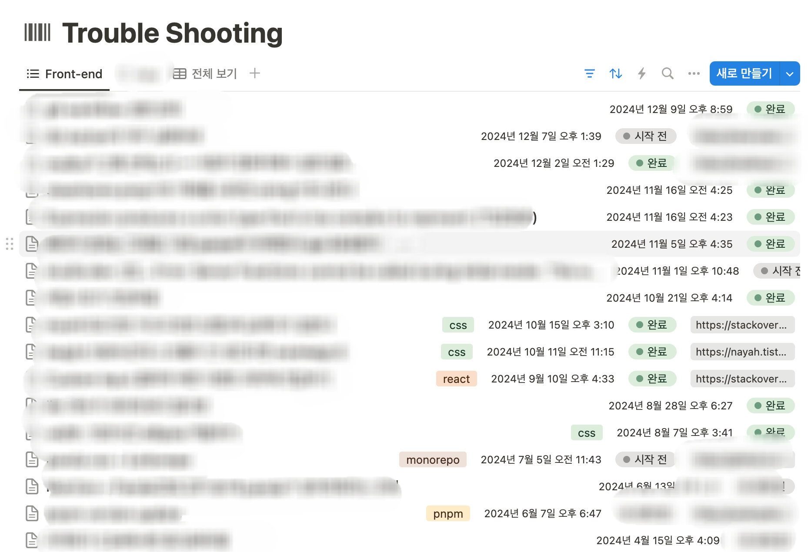

시간이 정말 빠르다. 벌써 한 해를 돌아볼 시간이 왔다.

2023년은 프론트 개발자로서 2-3년차를 보낸 해였다. 여기까지 오니 평소에 어떻게 공부하고, 공부한 지식을 어떻게 정리해야할지 틀이 잡힌 느낌이다.

블로그도 처음에는 이슈나 정보 전달의 목적으로 사용려고 만들었는데, 노션을 너무 잘 사용하고 있어서 경험이나 회고 위주로 작성하고 있다. 노션 정리도 처음에는 정보가 이리저리 분산되어있었는데 잘 틀이 잡혀가고 있다.

예전에는 사이드 프로젝트에 대한 욕심이 많았는데, 올해는 만드는 욕심은 내려놓고 스터디 위주로 보냈던 것 같다. 올해에도 회사에서 맡고 있는 프로덕트가 바뀌고 반년에 걸쳐 오픈까지 진행했어서 큰 변화가 있었던 해인 것 같다.

## 작년 회고를 다시 읽으며

작년에 남긴 2023회고 글에서는 네 가지를 2024년의 목표로 삼았었다.

1. **오픈소스 기여**
2. **다른 프로그래밍 언어**
3. **더 많은 git 명령어 자유자재로 다루기**
4. **더 많은 개발자들과 교류하기**

### 오픈소스 기여

- 작년과 똑같이 번역이나 오탈자 위주로 기여했다. 오탈자는 **vanilla extract, pandaCSS** 등 공식문서 읽다가 발견하여 기여했고, **devographics**는 2023년 state-of-css를 번역했었는데 2024년 설문 결과가 나왔길래 동료 개발자를 꼬드겨서 같이 번역했다.
  - 번역은 번역하면서 내용이 기억에 잘 남아서 의미 있는 것같다. 이번에 번역하면서 css 기능 중 `subgrid`에 대한 찬양이 계속 반복돼서 기억에 남았는데, 필요했던 기능같아서 언젠가 써보려고 벼르고 있다. (`can i use`에 나오는 사용률이 92%라서 실무에 당장 쓰기엔 좀 고민되는 것 같다.)
- 또, 오픈소스 기여라고 하기에 애매하지만 사용하고 있던 `amcharts5`라는 차트 라이브러리에서 wheelY가 zoom일 때 wheelDuruation이 동작하지 않는 이슈가 있었는데, 코드를 수정해주시거나 docs에 예외 상황에 대한 내용을 추가해달라고 요청을 드렸더니 받아들여져서 문서가 수정된 게 의미가 있었다. [**Issues #1398**](https://github.com/amcharts/amcharts5/issues/1398)
- **next.js 문서**에 기여한 일이 일도 의미 있었다. next.js page router를 사용하고 있었는데 문서의 설명을 따라 `prefetch={false}` 설정을 해도 라우트 호버시 prefetch가 발생하는 현상이 있었다. 의아해서 코드를 뜯어봤더니 앱 라우터일 때만 prefetch false가 적용되도록 되어있었다. 코드를 근거로 페이지 라우터 문서에 prefetch false가 적용되지 않는 다는 글을 추가했다. [**Pull Request #62182**](https://github.com/vercel/next.js/pull/62182)

### 다른 프로그래밍 언어

- 플러터를 공부해봤다. 해당 내용은 [**여기서**](https://suu3.github.io/회고/[2024-10-05]약_반년_간의_플러터_공부_회고/[2024-10-05]약_반년_간의_플러터_공부_회고/) 확인할 수 있다.

### 더 많은 git 명령어 자유자재로 다루기

- rebase로 협업하는 아티클을 본 뒤로 계속 쓰려고 벼르고 있었는데, 올해 회사에서 협업하면서 rebase를 사용했다. 잘못 사용해서 꼬이면 절망적이지만 잘 쓰면 깃 그래프가 예쁘게 나와서 좋았다.

### 더 많은 개발자들과 교류하기

- 스터디를 많이 했다. 3-5월에는 AWS SAA 자격증을 따는 스터디를 했다. 5월부터는 플러터 스터디를 했다. 7-8월에는 잇츠 스터디 크루 2기에 참여했다. 10월부터는 ‘리액트 인터뷰 가이드’라는 책 스터디에 참여했다.
  - 많은 개발자들을 만날 수 있었는데 의외로 내가 했던 고민들을 똑같이 하셨던걸 보면서 위로를 받기도하고, 앱 개발자 분들 만나며 저런 부분을 고민하는 구나 느끼기도 했다.

## 올해의 큰 전환점

### 자동화

배포 후에 여유가 잠깐 생겼었어서 자동화에 관심을 가지게 됐다. 코드리뷰를 위한 pr 알림을 보내는 git action 부터 playwright 테스트 workflow와 테스트 후 테스트 결과를 슬랙으로 보내는 워크플로우를 작성해봤다.

pr에 자동 라벨링을 하는 라벨러 액션이나 자동 버저닝 라이브러리 changeset도 추가해보았다.

### R3F를 접하다

계속 해보고 싶었는데, [**스터디**](https://suu3.github.io/회고/[2024-08-17]웹_애니메이션_스터디_결과물_및_회고/[2024-08-17]웹_애니메이션_스터디_결과물_및_회고/)를 통해 몇가지를 해볼 수 있었다. 해보니까 재밌었어서 더 해보고 싶다는 생각이 들었다. 이것 말고도 콜로소에서 [크리에이티브 코딩 강의](https://coloso.co.kr/products/creativecoder_jeonghyo)를 듣고 pixi.js를 사용해보았는데 라이브러리보다도 웹으로 이런 아이디어들을 만들어 낼 수 있구나 싶어 좋은 영감을 받았다.

### PandaCSS

이전에는 tailwind 한 번 써보고(사실 썼을 때 많이 불편했다..), 회사에서는 주로 scss 쓰고, 사플로 이모션 쓰고(styled-component 방식으로 썼는데 개인적으로 이 방식은 잘 맞지 않았다..) 여러가지 써보면서 css와 컴포넌트가 강하게 결합되어있는 애들은 나와 맞지 않는다… 다음은 vanilla extract를 써봐야겠다 하고 있었는데,
의외로 `vanilla extract`보다도 `pandaCSS`를 먼저 하게 되었다.

pandaCSS는 state of css 번역을 할 때 최근 부상한 css 프레임워크로 통계에 잡힌걸 봤던 기억이 있어서 알고 있었는데, 회사에서 같이 협업하는 동료개발자의 제안으로 pandaCSS로 프로젝트를 진행하게 되었다. 써본 결과 여태까지 사용해본 css 프레임워크 중에선 제일 잘 맞았다. 약간 이 기능도 저 기능도 포기하지못하면 다 제공해주마.. 하는 느낌으로 다양한 방식으로 css를 작성할 수 있었고 필요할 때 적재적소에 작성할 수 있어서 편했다.

### Next.js App Router

회사에서 page router로 프로젝트를 하고 있었으므로 (프로젝트 시작할 때 app router가 베타버전이었다.) app router는 사플로 해본게 다였다. 사플로 신 기술 공부하기는 좋지만 대규모 서비스를 만들 수 없으니 아무래도 다양한 트러블 슈팅을 경험하긴 어려웠는데, 회사에서 새로 들어가는 프로젝트를 app router로 시작하면서 page router와는 다른 점을 많이 느꼈다.

**가장 큰 차이로 page라는 큰 단위로 돌아갔던 넥스트가 더 쪼개져서 컴포넌트 단위로 돌아간다는 느낌**을 강하게 받았다.  
레이아웃이나 공통적으로 필요한 래퍼들은 \_app.tsx에서 컨트롤하고 각각 페이지에서 바꿔줬던 페이지 라우터와는 다르게, 앱 라우터는 그룹화 하여 다르게 넣어주는게 가능했고, 페이지의 getServerSideProps에서 프리페칭을 처리해야했던 페이지 라우터와 다르게 앱 라우터는 컴포넌트 단위로 생각할 수 있었다. 대신 기본적으로 ssr이 들어가면서 예상치 못한 이슈들을 겪었는데 예를들어 로컬 스토리지에 따라 다르게 렌더링하는 컴포넌트들은 useIsMouted 등의 훅을 써서 ssr을 방지해줘야했다.

### 노션 활용

1. 작년에 Today I Learned를 노션에 작성하고 있다고 했었는데, 올해에는 쓰다보니 일 단위보단 주 단위로 정리하는게 적당한 것 같아서 Weekly I Learned가 되었다. 역시 모든걸 기억하려고 하기보다, 나만의 데이터 베이스를 만들어놓고 필요할 때 꺼내 쓰는 게 나에게는 맞는 것 같다.
   - 이런식의 정리 방법이 맘에 들었어서 개발 외의 개인적으로 하고 있는 자기계발들도 노션에 하나의 데이터베이스를 만들고 주마다 해낸 일들을 기록하고 있다.
2. 트러블 슈팅 정리

   - 내가 생각했을 때 다른 문서와 마찬가지로 트러블 슈팅 정리가 잘 안되는 이유는 글을 잘 써서 남겨야한다는 생각때문이었다. 잘 정리해서 블로그에 남겨야지 하는 생각때문에 오히려 정리 못하고 넘어간 것들이 많았다. 때문에 러프하게 남기고 참고 링크를 남기도록 노션을 구성했다.
   - 

### 기타

- GPT에 대한 불신이 반쯤 사라지고 GPT 없이 못살게 됐다. 정확한 정보 전달 면에선 여전히 부족한데, 막막할 때 힌트를 얻거나 리팩토링에 대한 조언을 얻기 좋은 것 같다. 요즘은 커서를 써보고 있는데 아직은 좀 더 써봐야 커서의 장점을 알 수 있을 것 같다
- 올해 컨퍼런스는 인프콘만 참여했다. 올해의 인프콘도 내용이 좋았다. [관련해서 작성한 글](https://suu3.github.io/컨퍼런스/[2024-08-10]2년_연속_다녀온_인프콘_2024_후기/[2024-08-10]2년_연속_다녀온_인프콘_2024_후기/)은 여기서 볼 수 있다.

## 2025년에는?

1. **웹으로 예술 해보기** : 그림쟁이 개발자로서… three.js 틈틈이 공부해서 예술적인 웹을 만들고싶다는 개인적인 욕심이 있다. 관련해서 Bruno Simon 님의 three.js journey 강의를 샀는데 완강하고 싶다 ㅎㅎ
2. **라이브러리 or 익스텐션 or 플러그인 개발** : 진짜 일상을 개선시키는 개발을 해보고 싶다.
3. **블로그 next.js로 이전하기**
   1. 티스토리 → 갯츠비로 왔는데 왜 또 이전하는가.. 함은 글과 이미지가 늘어남에 따라 빌드 시간도 늘어나고 gh page로 올리는 것도 한계가 있을 것 같아서이다. 또, 기능 확장을 하려면 어드민이나 조회수같은 서버 기능도 추가하게 될텐데, 인프콘에서 next.js 블로그 세션에서 필요한 것만 ssg로 렌더링하는 ppr 방식을 듣고 옮기고 싶어졌다. 그 외에도 갯츠비를 쓰면서 필요한 플러그인을 찾았을 때 기본적인 것조차 스타수 0개의 유지보수 안되는 게 많았고 버전 충돌도 잦은 문제가 있었다. 배포 플랫폼도 옮기고 재작년 말 쯤에 급하게 만드느라 타입스크립트를 제대로 쓰지 못했는데 다시 제대로 작성하고 css 프레임워크도 바꾸고 싶다.
4. **서버 개발 찍먹** : 올해 플러터를 접하고 앱 개발자들의 고충을 알고싶었던 것처럼 서버개발자들의 고충도 이해해보고 싶다.
5. **읽어야지 하고 못읽고 있는 개발 책 읽기**
